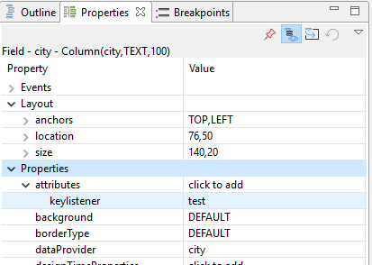

Welcome to the svyKeyListener wiki!

# Introduction
svyKeyListener is a simple service to send key strokes from the browser to a callback method executing on the server
This allows a developer to handle keystroke events inside the servoy environment. "keylistener" attribute of a component (from Properties view) must be used together with addKeyListener API of the service to get desired effect.

Table of contents
* [svyKeyListener API](#svykeylistener-api)

# svyKeyListener API

| Method | Params | Return       | Description
| :--------- |:--------------| :------------:| :-------------------------------------------------------------------|
| [addKeyListener](#addkeylistener) | callbackKey:string, callback:Function, [clearPreviousCallback:boolean], [delay:boolean], [regexPattern:boolean], [regexReplacement:boolean] | | Registers the listener on the components which have the "keylistener" attribute with the given callbackKey value, to call the given callback |
| [removeKeyListener](#removekeylistener) | callbackKey:string | boolean | Removes the listener associated to the given callback key |


## addKeyListener

Registers the listener on the components which have the "keylistener" attribute with the given callbackKey value, to call the given callback.
**Params**

| Type   | Name  | Description           | Required |
| :----- |:------| :--------------------| :---------- |
| string| callbackKey| The callback key. | Required|
| Function| callback| The function will be called and passed [string value, JSEvent event, number keyCode, boolean altKey, boolean ctrlKey, boolean shiftKey, boolean capsLock] | Required|
| boolean| clearCB| Specifies if the previously added callback associated to this callback key should be removed. | Optional|
| int| delay| Debouncing for callback function. The callback is fired only when the specified delay (milliseconds) has been pass.  If "delay" is not specified, a default delay of 1000 ms will be used." | Optional|
| String| regexPattern| Javascript regular expression string to modify current value of the component | Optional|
| String| regexReplacement| The value that is used to replace the regular expression with in the current value of the component | Optional|

**Returns** void

### example
On the component(s) you want to register the listener, you need to add a **keylistener** attribute.
Let's assume we add the **keylistener** attribute with the value **test** to be used as a callback key:



Then, for instance in the onShow method of the form, you need to associate that callback key to a function:
```javascript
function onShow(firstShow, event) {
	plugins.keyListener.addKeyListener('test', onKey)
}

function onKey(value, event, keyCode, altKey, ctrlKey, shiftKey, capsLock){
        application.output("The new value is "+value);
}
```

The behavior may be altered using optional parameters: 

```javascript
function onShow(firstShow, event) {
        // the onKey() will be triggered after 500 ms. The 'blue' string from the input value will be 
        // replaced with 'red' string.
	plugins.keyListener.addKeyListener('test', onKey, false, 500, 'blue', 'red');
}

function onKey(value, event, keyCode, altKey, ctrlKey, shiftKey, capsLock){
        application.output("The new value is "+value);
}
```


## removeKeyListener

Removes the listener associated to the given callback key. Returns true if the listener was removed.

**Params**

| Type   | Name  | Description           | Required |
| :----- |:------| :--------------------| :---------- |
| string| callbackKey| The callback key. | Required|

**Returns** boolean

### example
```javascript
function onAction(event) {
	if (plugins.keyListener.removeKeyListener('test')) {
           application.output("Removed the key listener associated to the callback key 'test'");
        }
}
```