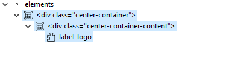
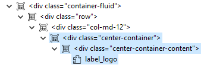
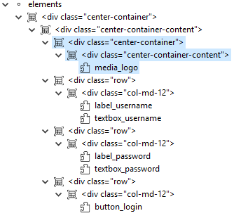
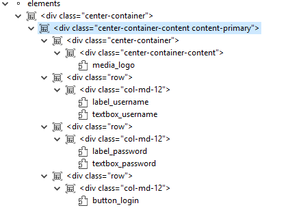
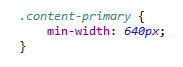

The Center Container allow it's content vertically and horizontally in a Servoy Responsive Form. 

You can drop Servoy Web Components and nest other 12Grid containers into it's content section. You can also nest center container within each other.

To center the content vertically the parent container must have a known height; if the height of it's parent container is not known the container will center it's content only horizontally.

Note that 12Grid rows and columns usually don't have a known height (unless their height is set in the syleSheet), therefore the center container contained in a 12Grid column will center it's content vertically.

## Center multiple elements

You can drop Servoy Web Components and nest other 12Grid containers into it's content section to center multiple elements as a single block. You can also nest multiple center container to center sub-content within the content section; note that as for the 12Grid rows, sub-content of the center container are center only horizontally by default (unless you define a known height or min-height to the sub center container via CSS); this is the case since the content of the top-level center container doesn't have a known height but is 'auto' calculated depending on it's content. 

## Width and Height of the center content

The center content section doesn't have a known height and width but it's height and width is set to '_auto_'; this means that the content section will grow as much it needs (depending on it's content) and not more.

Since the content section height and width is _auto_, a container or a web component which has width or height equal to 100%, will also fallback into width and height equal to _auto_. For example a textbox component having a _form-control_ class, which usually takes 100% of the width, won't grow to the whole available width instead will use it's default width (which has different value depending on browser version and OS system).

### Min Width

You can set a min-width to the content section (using CSS classes) to stretch it's content to a minimum dimension; inner containers and components having width equal to 100% will at least grow up to the min-width of the content section.

