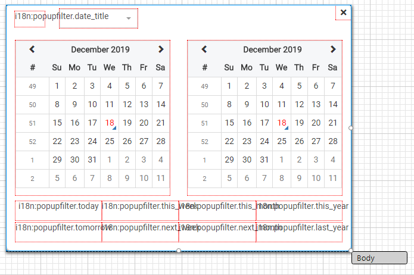

# Custom Templates

If you want to create your own templates used for any of the filter types (DATE, NUMBER, TEXT as tokens or TEXT as select list), you can do that by inheriting from one of the base forms provided. The module features a number of base forms in this hierarchy:

**AbstractPopupFilter**

* AbstractIntegerPopupFilter
  * svyIntegerPopupFilter
* AbstractNumberPopupFilter
  * svyNumberPopupFilter
* AbstractDatePopupFilter
  * svyDatePopupFilter
* AbstractTokenPopupFilter
  * svyTokenPopupFilter
* AbstractCheckPopupFilter
  * svyCheckPopupFilter

**AbstractLookupMulti (svyLookup)**

* svySelectPopupFilter

The abstract forms have no UI, while the implementations starting with `svy` do. The svySelectPopupFilter is a special case, because it inherits a form from the `svyLookup` project this extension requires.

## Register your form with the toolbar

When you have successfully created a suitable form you need to let the toolbar know to use it. That can be done via the method

`scopes.svyToolbarFilter.setPopupRendererForm(formType, form)`

which makes the filter use the given form for the given formType where a filter is used. An example call for a custom date filter form could look like this

`scopes.svyToolbarFilter.setPopupRendererForm(scopes.svyToolbarFilter.FILTER_TYPES.DATE, forms.myCustomDateFilter)`

## Use cases

There are probably two use cases to create your own templates:

### 1. Adjust some aspects ~~like translation~~ in the forms provided

~~In this scenario, you are most likely fastest when you inherit any of the forms prefixed with `svy` and modify them to your needs.~~

Since version 2.0.0 is possible to define translation programmatically using the scopes.svyPopupFilter.LOCALE object. Read more at [Locale](Home.md#new-locale).

### 2. Create a filter offering additional functionality

In this scenario, you will inherit any of the Abstract forms and build the UI yourself.

## Adjusting existing filter forms

For example, you may want to translate the strings used on the date filter. So you would start to create a new form in your solution by inheriting svyDatePopupFilter. You will get something like this in Servoy developer:

Now you can translate or re-label buttons (as shown in the example), change the appearance or whatever you want to adjust. For more customization options (for example if you want to remove buttons), the form could also be duplicated instead of inherited. In that case, you take over some responsibility for its functionality as well.

## Create a filter offering additional functionality

When creating your own filter for any of the for form types used by the toolbar (see `scopes.svyToolbarFilter.FILTER_TYPES` for the possible filter types), you either start inheriting from **AbstractPopupFilter** or **AbstractLookupMulti** from svyLookup (for the SELECT filter type). The minimum requirement for a filter to work is that you implement (override) the two methods

`setSelectedFilterValues`: is called when the filter form is shown and receives the currently selected values and updates the UI when needed to reflect that

`getSelectedFilterValues`: is called when the filter form is closed and returns the values the user chose

What needs to be returned depends on the value of the `operator` variable you inherit, which is one of scopes.svyPopupFilter.OPERATOR enum values. The operator can maybe be changed in your UI and should then be set on the operator variable. The values you return via getSelectedFilterValues must also match the operator. When the operator is `EQUALS` for example, you would return one value in the array, for `BETWEEN` two values and for `IS_IN` any number of values.

It might help to look at the default implementations prefixed with `svy` to get a better understanding of how this is done for different filter types.

The SELECT filter type makes use of svyLookup to allow the user to pick one or more values from a list and handles the setting and getting of values internally.
