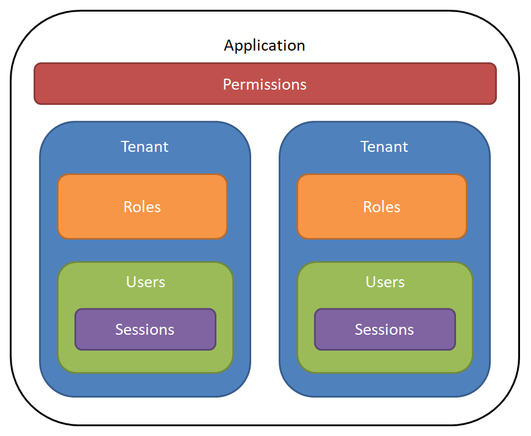

The **svySecurity** module is designed to provide a complete security-related functionality required by all modern business applications in an easy to learn and use format. It can be used as a complete replacement of the classic Servoy security functionality and includes additional features that provide out-of-the-box solutions for most security-related application needs. Some of these are: 
* multi-tenancy security for modern cloud-based SaaS solutions
* role-based permissions for easy yet powerful and flexible security configuration
* no password/token access for "self administration" tasks like forgotten passwords or integration with outside applications like embedded links for accessing reports or other content without compromising the security of the application
* detailed live and historical tracking of application access and usage duration
* Remembered devices and Single Sign-On (SSO) using JSON Web Tokens (JWT) - Since v1.5.0

### The **svySecurity** model

The **svySecurity** model is comprised of several classes which are organized in specific relations to implement the common security tasks required by most applications.



**Permissions** are application-specific descriptors of what parts of the application or its functionality are subject to security restrictions. The permissions are defined by the application developers at design-time and represent things like "can access Form A" or "can delete data from Table B" or "can perform Action C". The permissions are then used at run-time to change the application UI or behavior depending on the user. For example user A may be able to edit data in a specific field while for user B the same field could be disabled/read-only or even invisible. The same can be applied to any other action or data which a user can perform or access.

**Tenants** in svySecurity are used to segregate security configuration and data. They usually represent a company or other business or legal entity. In large organizations even separate branches or departments may be treated as "tenants". This allows the same application and database to be shared/used by different tenants where each tenant can have its own specific security settings.

**Users** in svySecurity represent individuals that are associated with a specific **tenant**. For example they may be an employee of the company or a client of the company. In addition to the identifying username, users also have passwords which are used by the application to authenticate them.

**Roles** in svySecurity represent sets of permissions associated with access to different parts, functionality or data of the application. The security roles usually have a direct mapping to actual business or functional roles of people or groups of people in a company. Each **tenant** has it own **roles** (similar to how each company or business entity has its own organizational structure). Each **role** can have multiple **permissions** granted to it. The same **permission** may be granted to multiple **roles** at the same time. In addition, **users** can be members of one or multiple **roles**. By adding a **user** as a member of a **role** all **permissions** granted to the role are automatically applied to the user. In svySecurity permissions can be granted **only** to roles. In order to grant specific permissions to a user, the user must be added as a member of the respective roles which have the necessary permissions.

**Sessions** in svySecurity represent individual instances of access to the application by users. A new session is started every time when a user successfully signs into the application and ends when the user signs out. If the application is terminated unexpectedly (for example if the user closes the browser or turns off the computer without signing out of the application first) the user session will remain active for a period of time before being automatically deactivated. The sessions allow the application to provide detailed tracking information of who and when accessed the application, how long the application was used and from what location (IP address).

### Master and sub-tenants
_(since v1.3.0)_
Each tenant has it's own set of roles with associated permissions; different tenants can therefore have different set of roles granting different permissions.
However it is a common requirement for all tenants, or for a group of tenants, to share the same set of roles and associated permissions. In such scenario a __Master__ tenant can be linked to multiple __sub-tenants__; any change to the Master tenant's roles and associated permissions will be propagated to all it's sub-tenants; the master and all it's sub-tenants will therefore share the same set of roles and associated permissions. Note that a sub-tenant should never modify independently it's roles and associated permissions, all changes should be done in the master tenant only.
<br/>
Learn more about [master and sub-tenants](Tenant-replication.md) in the dedicated wiki section.

### User Authentication
The svySecurity module provides several options for user authentication:
* **username/password** - the classing authentication mechanism where the user must provide a valid username and password combination in order to be given access to the application. Due to the multi-tenancy support in svySecurity, a tenant context is also required for this type of authentication. This can be achieved either by providing an option on the UI to specify the tenant associated with the user account or the tenant may be provided as a deep-link argument to the login solution (for example, a common practice is to have a unique URL for each SaaS client). Please note, that svySecurity does not store user passwords. Only unique hashes of passwords are stored by the system which are then used for the svySecurity authentication.
* **access token** - some scenarios may require that a user is given (some) access to the system without specifying a password. The most common example is when the user has forgotten the password. For these cases the svySecurity allows unique, one-time-usage access token to be generated. The token is associated with a specific user account and can be used to access the system. Usually the access in such cases is restricted (for example, allowing the user only to specify a new password). The access token may be generated with a specific validity period after which it will expire automatically. Upon usage the token is automatically deleted. 
* **third-party authentication** - it is possible to use third-party systems for authenticating users (for example, using Facebook, LinkedIn or Google). In this case the svySecurity will not be performing the actual user authentication but will only provide the user context for the application.
* **Remember Devices and Single Sign-on** _(Since v1.5.0)_ 
SvySecurity allows developers to enable Token-Based Authentication Mode, which allows users to be authenticated for longer than a single session. When enabled, users are not required to authenticate each time they open an application. Instead, they will be remembered for a configurable amount of time, or until they log out. This approach can also be used to allow users to authenticate to multiple solutions with a single log-in. *Note that this is different than, one-time Access Tokens, used for deeplinks and forgotten passwords.

To help developers with the common user-authentication tasks the svySecurity includes a base login form which provides all the necessary functionality. Developers only need to extend it and provide the UI to get a fully functional login page. The provided example solution **svySecurityExample** has a reference implementation of such a login page with user/password authentication and resetting forgotten password functionality.

### Security Administration
The API of the svySecurity module provides all the necessary features for implementing robust security management and administration - from creating tenants and users to configuring permissions and user-role membership. The svySecurity includes a ready-to-use [**Security Management Console**](Security-Management-Console.md) which provides out of the box options for managing tenant and user accounts, security configuration, usage statistics and more.

### Securing Your Application
One of the main goals of the svySecurity module is to help developers secure their applications. With the svySecurity module developers can quickly and easily add to their applications robust security features. This can be achieved using the following options:
* Applying security configuration at design time - this involves configuring the security settings of form UI elements and tables at design-time using the Security tab of the form and table editors.
* Performing run-time security checks - this involves using the svySecurity API in your code to check the security permissions of the current user and modify the application behavior and/or UI accordingly.

Both options can be used independently or in combination to achieve the required results for your applicaiton.

### Permissions in svySecurity and their relation to the classic Servoy security groups
In order to support design-time security configurations the svySecurity "maps" the **permissions** to the classic Servoy **security groups**. This requires developers to create in Servoy Developer a classic security group for each permission which they want to have in the application. The security group names must **match exactly** the names of the permissions. In essence, the classic security groups are used only as permission placeholders so they can be available in the form and table editors in Servoy Developer and no further classic user and group assignments are needed neither in Servoy Developer nor in the Servoy Application Server Admin Page. The only exception to this is related to the svySecurity Security Management Console - it can be accessed only by Servoy Application Server administrators (classic Servoy security users which are members of the built-in classic Servoy security group Administrators).

### Synchronizing Permissions & Auto-sync
As mentioned above the permissions entries are mapped to the classic Servoy's security groups. While running the svySecurity in a developer environment the svySecurity will synchronize the permissions from the Servoy's security groups into the svySecurity permissions table at every user login. 

As default behavior the svySecurity module with automatically synchronize the permissions from the Servoy's security groups at every login also in a deployed solution.
Such default behavior is setup to facilitate your testing and your first deployment, however synchronizing permissions at every login can impact the perfomances of your solution.
Is therefore recommended to use a postImportHook module running scopes.svySecurity.syncPermissions() to synchronize permissions at every new deployement instead and disable auto-sync for every login.
Auto-sync can be disabled by setting the user property svy.security.auto-sync-permissions-when-deployed=false.

The user property can be set in the user.properties setting of the admin-page or directly in the servoy.properties file used for the deployed instance.

```user.svy.security.auto-sync-permissions-when-deployed=false```

### Login User ID & Auto-Enter

Available since v1.6.0

The Servoy logged User UID may be used as *Auto-Enter* value to populate automatically columns of newly created records (see [AutoEnterDefinitions](https://wiki.servoy.com/display/DOCS/Auto-Enter+Definitions)).

By default when using the svySecurity module, the User's *username* value fills the Auto-Enter value for the [Creation user UID](https://wiki.servoy.com/display/DOCS/Auto-Enter+Definitions#AutoEnterDefinitions-CreationUserUID) and [Modification user UID](https://wiki.servoy.com/display/DOCS/Auto-Enter+Definitions#AutoEnterDefinitions-ModificationUserUID).

Since version 1.5.0 of svySecurity the User can be identified by an unique UUID. Optionally the user's *UUID* can be used instead of the User's *username* as Auto-Enter value. Such option can be enabled by setting the user property svy.security.login-with-user-id-as-user-uid=true.

The user property can be set in the user.properties setting of the admin-page or directly in the servoy.properties file used for the deployed instance.

```user.svy.security.login-with-user-id-as-user-uid=true```

### *New Cache Permissions for enhanced perfomance

Available since v2022.3.0

The svySecurity module is now configured to cache user permissions upon login; doing so can considerably improve perfomance since will verify user permissions against the session cache. Please note that when using cached permissions the user won't acquire any newly assigned permission until next login.

You can disable the permission cache by setting the user property svy.security.use-cache=false.
The user property can be set in the user.properties setting of the admin-page or directly in the servoy.properties file used for the deployed instance.

```user.svy.security.use-cache=false```

However is highly recommended to keep this option enabled if your solution has a large number of permissions.


### *New Create Sample Data

Available since v2022.3.0

To facilitate access to the svySecurity module, upon launch the svySecurity module creates sample data ( sample Tenant with sample User & Role ) when there are no Tenants.
When deploying your solution on a live environment, likely you don't want to have sample data created for you.

You can opt out this behavior by setting the user property svy.security.create-sample-data=false.
The user property can be set in the user.properties setting of the admin-page or directly in the servoy.properties file used for the deployed instance.

```user.svy.security.create-sample-data=false```
