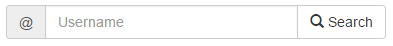
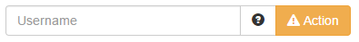
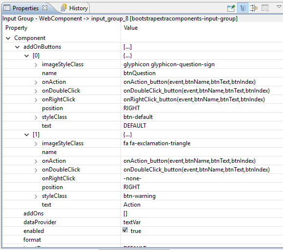

# Input Group

Inputgroups are input fields with text- or button add-ons grouped into one element such as this one:

## Table of contents

* [Inputgroup properties](Inputgroup.md#inputgroup-properties)
* [AddOn type](Inputgroup.md#addon-type)
* [AddOnButton type](Inputgroup.md#addonbutton-type)
* [Inputgroup events](Inputgroup.md#inputgroup-events)
* [Inputgroup API](Inputgroup.md#inputgroup-api)

## Inputgroup properties

The component has the following properties:

| Property        | Type           | Default | Description                                                      |
| --------------- | -------------- | ------- | ---------------------------------------------------------------- |
| addOnButtons    | AddOnButton\[] | null    | An array of buttons added either left or right of the field      |
| addOns          | AddOn\[]       | null    | An array of text add-ons added either left or right of the field |
| dataProvider    | dataprovider   | null    | The dataprovider for the text field                              |
| enabled         | Boolean        | true    | The enable state of the component, default true.                 |
| format          | String         | null    | The field's format                                               |
| inputType       | String         | text    | The input type of the field ("text", "password" or "number")     |
| playeholderText | String         | null    | The placeholder text of the text field                           |
| readOnly        | dataprovider   | false   | The readonly state of the component, default false.              |
| styleClass      | String         | null    | Additional style class(es) of the component                      |
| tabSeq          | Number         | null    | The element's tab sequence                                       |
| visible         | Boolean        | true    | The visible property of the component, default true.             |

### AddOnButton type

AddOnButton is a component specific javascript type with the following properties:

| Property        | Type     | Default                                                        | Description                                                                                                                                                                                                 |
| --------------- | -------- | -------------------------------------------------------------- | ----------------------------------------------------------------------------------------------------------------------------------------------------------------------------------------------------------- |
| imageStyleClass | String   | null                                                           | An optional style class to render an image before the button's text. Any glyhicon or font awesome icon can be used (e.g. "glyphicon glyphicon-search" or "fa fa-car")                                       |
| name            | String   | null                                                           | The name of the button (that name is passed as second argument to any event handler fired from the button)                                                                                                  |
| onAction        | Function | event:JSEvent, btnName:String, btnText:String, btnIndex:Number | onAction method of the button. The method fired receives a JSEvent, the button name, the button text and the button index as arguments.                                                                     |
| onDoubleClick   | Function | event:JSEvent, btnName:String, btnText:String, btnIndex:Number | onDoubleClick method of the button. The method fired receives a JSEvent, the button name, the button text and the button index as arguments.                                                                |
| onRightClick    | Function | event:JSEvent, btnName:String, btnText:String, btnIndex:Number | onRightClick method of the button. The method fired receives a JSEvent, the button name, the button text and the button index as arguments.                                                                 |
| position        | String   | "RIGHT"                                                        | Controls whether the button is shown left ("LEFT") or right ("RIGHT") of the text field. Default is "RIGHT"                                                                                                 |
| styleClass      | String   | "btn-default"                                                  | Optional styleClass for the button. Typically one of bootstraps button classes ("btn-default", "btn-primary", "btn-success", "btn-info", "btn-warning", "btn-danger", "btn-link"). Default is "btn-default" |
| text            | String   | null                                                           | The text of the button                                                                                                                                                                                      |

Here is an example with two buttons:

In developer these buttons are defined as shown in the following screenshot:

### AddOn type

AddOn is a component specific javascript type with the following properties:

| Property | Type   | Default | Description                                                                                                 |
| -------- | ------ | ------- | ----------------------------------------------------------------------------------------------------------- |
| position | String | "RIGHT" | Controls whether the button is shown left ("LEFT") or right ("RIGHT") of the text field. Default is "RIGHT" |
| text     | String | null    | The text to show                                                                                            |

## Inputgroup events

| Event         | Params                                          | Return  | Description                                                                     |
| ------------- | ----------------------------------------------- | ------- | ------------------------------------------------------------------------------- |
| onAction      | event:JSEvent                                   |         | Method that is executed when the enter key is hit.                              |
| onDataChange  | oldValue:String, newValue:String, event:JSEvent | Boolean | Method that is executed when the data in the component is successfully changed. |
| onFocusGained | event:JSEvent                                   |         | The method that is executed when the component gains focus.                     |
| onFocusLost   | event:JSEvent                                   |         | The method that is executed when the component looses focus.                    |
| onRightClick  | event:JSEvent                                   |         | The method that is executed when a right click occurs in the text field.        |

## Inputgroup API

| Method                                               | Params                                                                                | Return | Description                                  |
| ---------------------------------------------------- | ------------------------------------------------------------------------------------- | ------ | -------------------------------------------- |
| [addAddOn](Inputgroup.md#addaddon)                   | addOn:[AddOn](Inputgroup.md#addon-type)                                               |        | Adds an add-on text to the component.        |
| [addAddOnButton](Inputgroup.md#addaddonbutton)       | 
addOnButton:

<a href="Inputgroup.md#addonbutton-type">addOnButton</a>
    |        | Adds an add-on button to the component.      |
| [clearAddOnButtons](Inputgroup.md#clearaddonbuttons) |                                                                                       |        | Removes all buttons from the component.      |
| [clearAddOns](Inputgroup.md#clearaddons)             |                                                                                       |        | Removes all add-on texts from the component. |
| [setAddOns](Inputgroup.md#setaddons)                 | addOns:[AddOn\[\]](Inputgroup.md#addon-type)                                          |        | Sets all add-on texts of the component.      |
| [setAddOnButtons](Inputgroup.md#setaddonbuttons)     | 
addOnButtons:

<a href="Inputgroup.md#addonbutton-type">addOnButton[]</a>
 |        | Sets all add-on buttons of the component.    |
| [requestFocus](Inputgroup.md#requestFocus)           |                                                                                       |        | Requests the focus of the text field.        |

### addAddOn

**Params**

| Type                              | Name       | Description                                  | Required |
| --------------------------------- | ---------- | -------------------------------------------- | -------- |
| [AddOn](Inputgroup.md#addon-type) | addOnToAdd | The [AddOn](Inputgroup.md#addon-type) to add | Required |

**Returns** void

Adds the given [AddOn](Inputgroup.md#addon-type) to the component.

### addAddOnButton

**Params**

| Type                                          | Name             | Description                                              | Required |
| --------------------------------------------- | ---------------- | -------------------------------------------------------- | -------- |
| [AddOnButton](Inputgroup.md#addonbutton-type) | addOnButtonToAdd | The [AddOnButton](Inputgroup.md#addonbutton-type) to add | Required |

**Returns** void

Adds the given [AddOnButton](Inputgroup.md#addonbutton-type) to the component.

### clearAddOnButtons

**Params** none

**Returns** void

Removes all add-on buttons from the component.

### clearAddOns

**Params** none

**Returns** void

Removes all add-on texts from the component.

### setAddOns

**Params**

| Type                                  | Name   | Description             | Required |
| ------------------------------------- | ------ | ----------------------- | -------- |
| [AddOn\[\]](Inputgroup.md#addon-type) | addOns | The add-on texts to set | Required |

**Returns** void

Sets all add-on texts of the component.

### setAddOnButtons

**Params**

| Type                                              | Name         | Description               | Required |
| ------------------------------------------------- | ------------ | ------------------------- | -------- |
| [AddOnButton\[\]](Inputgroup.md#addonbutton-type) | addOnButtons | The add-on buttons to set | Required |

**Returns** void

Sets all add-on buttons of the component.

### requestFocus

**Params** none

**Returns** void

Requests the focus of the component.
