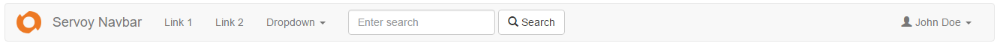

# Navbar

The Navbar component wraps a bootstrap navbar (see [here](http://getbootstrap.com/components/#navbar) for details) into a component usable directly from within Servoy.



A Navbar is a simple navigation bar that offers

* an optional branding logo on the left (the Servoy logo in the example above)
* an optional branding text on the left ("Servoy Navbar" in the example above)
* two bars with any number of
* plain texts
* single clickable menu entries
* dropdown menus showing a menu (one level)
* buttons
* text fields (optionally as type aheads)

One of the two bars is aligned to the left, the other to the right. Either one or both can be set.

Each item in the bar is a [MenuItem](Navbar.md#menuitem-type) javascript object with a position ("LEFT" or "RIGHT") and a displayType (e.g. "BUTTON") that controls how the single entry is displayed. Depending on the displayType a MenuItem's properties can have component specific meaning (for example the text property is used as placeholder text for an input field).

## Table of contents

* [Navbar properties](Navbar.md#navbar-properties)
* [MenuItem type](Navbar.md#menuitem-type)
  * [Display type MenuItem](Navbar.md#display-type-menuitem)
  * [Display type Text](Navbar.md#display-type-text)
  * [Display type Button](Navbar.md#display-type-button)
  * [Display type Input](Navbar.md#display-type-input)
  * [Display type Inputgroup](Navbar.md#display-type-inputgroup)
* [SubMenuItem type](Navbar.md#submenuitem-type)
* [Navbar events](Navbar.md#navbar-events)
* [Navbar API](Navbar.md#navbar-api)

## Navbar properties

The component has the following core properties:

| Property              | Type                                    | Default | Description                                                                             |
| --------------------- | --------------------------------------- | ------- | --------------------------------------------------------------------------------------- |
| brandLogo             | Media                                   |         | An optional media shown as branding logo in the upper left corner.                      |
| brandLogoStyleClass   | String                                  | null    | Optional style class(es) that can be added to the brandLogo media.                      |
| brandText             | String                                  |         | An optional branding text shown in the upper left corner (after the optional brandLogo) |
| fixed                 | String                                  |         | Controls whether the toolbar is fixed to either top or bottom of the screen             |
| inverse               | Boolean                                 | false   | When `true`, the navbar will be shown inverted (usually white text on black bar)        |
| markClickedItemActive | Boolean                                 | false   | When `true`, items of displayType MENU\_ITEM will be shown as "active" when clicked     |
| menuItems             | [menuItem\[\]](Navbar.md#menuitem-type) | null    | The array holding all menu items currently shown                                        |
| readOnly              | dataprovider                            | false   | The readonly state of the component, default false.                                     |
| styleClass            | String                                  | null    | Additional style class(es) of the component                                             |
| visible               | Boolean                                 | true    | The visible property of the component, default true.                                    |

### MenuItem type

MenuItem is a custom type of the Navbar component describing an entry in the navbar with the following properties:

| Property              | Type                                          | Default       | Description                                                                                                                                                                                                                                                                                                                        |
| --------------------- | --------------------------------------------- | ------------- | ---------------------------------------------------------------------------------------------------------------------------------------------------------------------------------------------------------------------------------------------------------------------------------------------------------------------------------- |
| dataProvider          | Dataprovider                                  |               | Dataprovider for a text field (only used for display types "INPUT" and "INPUT\_GROUP")                                                                                                                                                                                                                                             |
| displayType           | String                                        | MENU\_ITEM    | Controls the appearance of the menu item. One of "MENU\_ITEM", "TEXT", "BUTTON", "INPUT" or "INPUT\_GROUP". Default is "MENU\_ITEM".                                                                                                                                                                                               |
| iconName              | String                                        |               | An optional icon added to the menu item. Any glyhicon or font awesome icon can be used (e.g. "glyphicon glyphicon-search" or "fa fa-car"). When used with INPUT or INPUT\_GROUP used as the button's icon.                                                                                                                         |
| inputButtonStyleClass | String                                        | "btn-default" | Style class to control the optional button shown with INPUT or INPUT\_GROUP. Typically one of bootstraps button classes ("btn-default", "btn-primary", "btn-success", "btn-info", "btn-warning", "btn-danger", "btn-link"). Default is "btn-default"                                                                               |
| inputButtonText       | String                                        |               | Text of the optional button shown with INPUT or INPUT\_GROUP.                                                                                                                                                                                                                                                                      |
| isActive              | Boolean                                       | false         | When `true`, a MENU\_ITEM item will be shown as "active"                                                                                                                                                                                                                                                                           |
| position              | String                                        | "LEFT"        | Controls whether an item is shown on the left or on the right of the navbar.                                                                                                                                                                                                                                                       |
| itemId                | String                                        |               | Identifier of a menu item. This property is required to allow the component to figure out what item a user selected                                                                                                                                                                                                                |
| styleClass            | String                                        | null          | Additional style class(es) of the component                                                                                                                                                                                                                                                                                        |
| subMenuItems          | [subMenuItem\[\]](Navbar.md#submenuitem-type) |               | An optional array of sub menus for a MENU\_ITEM type. When set, the item will be shown as a dropdown.                                                                                                                                                                                                                              |
| text                  | String                                        |               | The text shown. Is used as placeholder text on INPUT or INPUT\_GROUP items.                                                                                                                                                                                                                                                        |
| tooltip               | String                                        |               | An optional tooltip for the item.                                                                                                                                                                                                                                                                                                  |
| valuelist             | Valuelist                                     |               | When set, an INPUT or INPUT\_GROUP item will show a typeahead list.                                                                                                                                                                                                                                                                |
| onAction              | Function                                      |               | Function that will be called if the item is clicked on (MENU\_ITEM, BUTTON), a submenu is selected (MENU\_ITEM with subMenuItems) or the user hits enter, leaves the field or clicks the optional button (INPUT, INPUT\_GROUP). If not set, the component will call the onMenuItemClicked method assigned to the component itself. |

#### Display type MenuItem

Simple clickable entry in the navbar.

Example with just the text:


Example with icon and submenus:


Example of an opened submenu:


For an item of displayType "MENU\_ITEM" the MenuItem properties are used as:

| Property              | Usage                                                                            |
| --------------------- | -------------------------------------------------------------------------------- |
| dataProvider          | not used                                                                         |
| iconName              | icon to the left of the entry's name                                             |
| inputButtonStyleClass | not used                                                                         |
| inputButtonText       | not used                                                                         |
| subMenuItems          | When set, the item will be shown as a dropdown menu                              |
| valuelist             | not used                                                                         |
| onAction              | Fired when the user clicks on the item or selects an item from the dropdown menu |

#### Display type Text

Plain text shown in the bar:


For an item of displayType "TEXT" the MenuItem properties are used as:

| Property              | Usage                                |
| --------------------- | ------------------------------------ |
| dataProvider          | not used                             |
| iconName              | icon to the left of the entry's name |
| inputButtonStyleClass | not used                             |
| inputButtonText       | not used                             |
| subMenuItems          | not used                             |
| valuelist             | not used                             |
| onAction              | not fired                            |

#### Display type Button

A normal button.

Example with text "Button 1", iconName "glyphicon glyphicon-camera" and styleClass "btn-primary":


For an item of displayType "BUTTON" the MenuItem properties are used as:

| Property              | Usage                                                                                                                                                                                        |
| --------------------- | -------------------------------------------------------------------------------------------------------------------------------------------------------------------------------------------- |
| dataProvider          | not used                                                                                                                                                                                     |
| iconName              | icon to the left of the entry's name                                                                                                                                                         |
| inputButtonStyleClass | not used                                                                                                                                                                                     |
| inputButtonText       | not used                                                                                                                                                                                     |
| subMenuItems          | not used                                                                                                                                                                                     |
| valuelist             | not used                                                                                                                                                                                     |
| onAction              | fired when the user clicks on an item                                                                                                                                                        |
| styleClass            | Button style class. Typically one of bootstraps button classes ("btn-default", "btn-primary", "btn-success", "btn-info", "btn-warning", "btn-danger", "btn-link"). Default is "btn-default". |

#### Display type Input

An item of type "INPUT" adds a text field to the navbar. The text field can have an optional button grouped next to it when the inputButtonText or iconName (or both) property is set.

Example with iconName and inputButtonText:


For an item of displayType "INPUT" the MenuItem properties are used as:

| Property              | Usage                                                                                                                                                                                                  |
| --------------------- | ------------------------------------------------------------------------------------------------------------------------------------------------------------------------------------------------------ |
| dataProvider          | used to assign the dataprovider of the field                                                                                                                                                           |
| iconName              | When set a button with that icon is shown next to the input field. Any glyhicon or font awesome icon can be used (e.g. "glyphicon glyphicon-search" or "fa fa-car").                                   |
| inputButtonStyleClass | Used for the optional button. Typically one of bootstraps button classes ("btn-default", "btn-primary", "btn-success", "btn-info", "btn-warning", "btn-danger", "btn-link"). Default is "btn-default". |
| inputButtonText       | When set a button with the text is shown next to the input field.                                                                                                                                      |
| subMenuItems          | not used                                                                                                                                                                                               |
| valuelist             | When set, the input will show a typeahead list.                                                                                                                                                        |
| onAction              | fired when the user hits enter in the field, leaves the field or clicks on the optional button next to the field.                                                                                      |

#### Display type Inputgroup

An item of type "INPUT\_GROUP" behaves the same as [INPUT](Navbar.md#display-type-input) except that the field is rendered along with optional button as an inputgroup. There is no spacing between the field and the button.

Example with iconName and inputButtonText:


### SubMenuItem type

SubMenuItem is a custom type of the Navbar component describing an entry of a submenu of a MenuItem of displayType MENU\_ITEM. It has the following properties:

| Property  | Type     | Default | Description                                                                                                                                                                                                |
| --------- | -------- | ------- | ---------------------------------------------------------------------------------------------------------------------------------------------------------------------------------------------------------- |
| iconName  | String   |         | An optional icon added to the menu item. Any glyhicon or font awesome icon can be used (e.g. "glyphicon glyphicon-search" or "fa fa-car"). When used with INPUT or INPUT\_GROUP used as the button's icon. |
| itemId    | String   |         | Identifier of the menu item. This property is required to allow the component to figure out what item a user selected                                                                                      |
| text      | String   |         | The text shown.                                                                                                                                                                                            |
| onAction  | Function |         | Function that will be called if the item is selected. If not set, the component will call the onMenuItemClicked method assigned to the component itself.                                                   |
| isDivider | Boolean  | false   | When true the entry is shown as a menu separator (then all other properties are ignored).                                                                                                                  |

## Navbar events

| Event             | Params                                                      | Return | Description                                                                                                                                                                                                                                                                                                         |
| ----------------- | ----------------------------------------------------------- | ------ | ------------------------------------------------------------------------------------------------------------------------------------------------------------------------------------------------------------------------------------------------------------------------------------------------------------------- |
| onMenuItemClicked | event:JSEvent, menuItem:[MenuItem](Navbar.md#menuitem-type) |        | Method that will be called if the item is clicked on (MENU\_ITEM, BUTTON), a submenu is selected (MENU\_ITEM with subMenuItems) or the user hits enter, leaves the field or clicks the optional button (INPUT, INPUT\_GROUP). This method is only called when the menu item itself has no onAction method assigned. |

## Navbar API

| Method                                       | Params                                           | Return | Description                                                                                                 |
| -------------------------------------------- | ------------------------------------------------ | ------ | ----------------------------------------------------------------------------------------------------------- |
| [setMenuItems](Navbar.md#setmenuitems)       | menuItems:[menuItem](Navbar.md#menuitem-type)\[] |        | Sets all menu items of the nav bar.                                                                         |
| [addMenuItem](Navbar.md#addmenuitem)         | menuItem:[menuItem](Navbar.md#menuitem-type)     |        | Adds the given menu item to the bar.                                                                        |
| [removeMenuItem](Navbar.md#removemenuitem)   | itemId:String                                    |        | Removes the item with the given ID from the bar.                                                            |
| [setMenuSelected](Navbar.md#setmenuselected) | itemId:String                                    |        | Sets the item with the given ID as selected (marks it "active"). Only visible for items of type MENU\_ITEM. |
| [getSelectedMenu](Navbar.md#getselectedmenu) |                                                  |        | Returns the currently selected menu.                                                                        |

### setMenuItems

Sets all menu items of the navbar. The branding remains untouched.

**Params**

| Type                                   | Name      | Description            | Required |
| -------------------------------------- | --------- | ---------------------- | -------- |
| [menuItem](Navbar.md#menuitem-type)\[] | menuItems | The menu items to set. | Required |

**Returns** void

**Example code**

```
var menuItems = [];

menuItems.push({itemId: '1', text: 'Accounts', tooltip: 'Accounts'});
menuItems.push({itemId: '2', text: 'Invoices', tooltip: 'Invoices'});
menuItems.push({itemId: '3', text: 'Click me', displayType: 'BUTTON', tooltip: 'Button'});
menuItems.push({text: 'Payables', tooltip: 'Payables'});
menuItems.push({itemId: '5', text: 'Search account...', displayType: 'INPUT', iconName: 'glyphicon glyphicon-search', tooltip: 'Search'});
menuItems.push({itemId: '6', text: 'Menu', position: 'RIGHT', tooltip: 'A submenu', subMenuItems: [{itemId: '6.1', text: 'Action'}, {itemId: '6.2', text: 'More action'}, {isDivider: true}, {itemId: '6.3', text: 'Last action'}]});
menuItems.push({itemId: '7', text: 'Logged in as John Doe', tooltip: 'just text', displayType: 'TEXT', position: 'RIGHT'});

elements.navbar.brandText = 'Accounting';
elements.navbar.setMenuItems(menuItems);
```

### addMenuItem

Adds the given item to the navbar.

**Params**

| Type                                | Name      | Description     | Required |
| ----------------------------------- | --------- | --------------- | -------- |
| [menuItem](Navbar.md#menuitem-type) | itemToAdd | The item to add | Required |

**Returns** void

**Example code**

```
/** @type {bootstrapextracomponents-navbar.menuItem} */
var itemToAdd = {
	itemId: application.getUUID().toString(), 
	text: 'Item added'
}
elements.navbar.addMenuItem(itemToAdd);
```

### removeMenuItem

Removes the item with the given itemId from the bar.

**Params**

| Type   | Name   | Description                          | Required |
| ------ | ------ | ------------------------------------ | -------- |
| String | itemId | The identifier of the item to remove | Required |

**Returns** void

### setMenuSelected

Sets the item with the given ID as selected (sets the isActive property). Items of type MENU\_ITEM will be rendered with a different background color when selected.

**Params**

| Type   | Name   | Description                          | Required |
| ------ | ------ | ------------------------------------ | -------- |
| String | itemId | The identifier of the item to remove | Required |

**Returns** void

### getSelectedMenu

Returns the currently selected menu item.

**Params** none

**Returns** void
