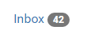

# Badge

## Overview

This guide will show how to use badges in your applications. See how easy it is to drag and drop badges onto your forms and connect them to your business logic. Badges can be modified, styled and even changed at runtime.

The badge component can be used to easily highlight new or unread items in labels or buttons.

Label example:

<figure><figcaption><p>Label</p></figcaption></figure>

Button example:

<figure><figcaption><p>Button</p></figcaption></figure>

## Get Started

In the [Form Editor](../../../../../reference/readme\_servoycore/page-3/object-editors/form-editor.md), drag the Badge component from the Pallet onto the form.


If the component does not appear in the pallet, it means you do not have the Bootstrap Extra Components package installed. Click "Get more components" at the top of the pallet to open the [Servoy Package Manager](../../../../../reference/readme\_servoycore/page-3/package-manager.md) and install it.


## Modifying a Badge at Design-Time

Badges, like all components, have properties which can be modified at design-time to set the appearance and behavior of the component. Select the badge in the [Form Editor](../../../../../reference/readme\_servoycore/page-3/object-editors/form-editor.md) to see a list of properties in the [Component Properties Editor](../../../../../reference/readme\_servoycore/page-3/object-editors/component-properties-editor.md). Below are some common properties and how to set them at design-time.


See the reference docs for [Badge](../../../../../reference/readme\_servoyextensions/ui-components/buttons-and-text/badges.md) for a complete list of its [properties](../../../../../reference/readme\_servoyextensions/ui-components/buttons-and-text/badges.md#properties-summary).


### Setting the Text

The text displayed on the label or button can be modified by setting its [`text`](../../../../../reference/readme\_servoyextensions/ui-components/buttons-and-text/badges.md#text) property. Most often, this will just be plain text, such as "Messages" or "Inbox". In this case, just enter the value into the editor or directly on the component by double-clicking it. For more options open the [Text Property Editor](../../../../../reference/readme\_servoycore/page-3/object-editors/text-property-editor.md).

### Setting the badgeText

The badge text shown on the label or button can be modified by setting its [badgeText ](../../../../../reference/readme\_servoyextensions/ui-components/buttons-and-text/badges.md#badgetext)property. Usually this will be dynamic, otherwise just enter the value into the editor. For more options open the [Text Property Editor](../../../../../reference/readme\_servoycore/page-3/object-editors/text-property-editor.md).



Remember that text can also be dynamic, data-driven[^1] or localized[^2]. For more options, you can open edit the text property in the [Text Property Editor](../../../../../reference/readme\_servoycore/page-3/object-editors/text-property-editor.md).


### Setting an Image / Font-Icon

Many times, a badge will be decorated with an image or font icon. To add an image to your badge, edit the [`imageStyleClass`](../../../../../reference/readme\_servoyextensions/ui-components/buttons-and-text/badges.md#imagestyleclass) property and choose the image style class of the font icon you wish to use. For example, enter a value of `fa-regular fa-envelope` to get a nice "Messages" icon.

<figure><figcaption></figcaption></figure>

For more information, please see the [Font Icon](../../styling-and-themes/font-icons.md) section of the guide on [Styling and Themes](../../styling-and-themes/).

### Styling

Like all components, baqdges can be styled using themes and raw CSS. To apply any available style class, simply enter one or more space-delimited values for the `styleClass` property.

   For example, `styleClass="font-weight-bold h3 border-class"`

## Handling Events

Like most components, Badges have events, which allow you to execute some logic when something happens in the UI. Of course, the most common event for a badge is the `onAction` event, which is triggered when the component is clicked or the user hits the `Enter` key while the badge has focus.

To Handle the event, double-click the value for the `onAction` property in the [Properties Editor](../../../../../reference/readme\_servoycore/page-3/object-editors/component-properties-editor.md). You will see the [Method Selection Wizard](../../../../../reference/readme\_servoycore/page-3/object-editors/method-selection-wizard.md). You'll have the option select an existing Method or create a new Method. The method will be called when the badge's `onAction` event is fired and the [Event](../../../../../reference/readme\_servoycore/dev-api/application/jsevent.md) object will be passed to it.

```javascript
/**
 * @param {JSEvent} event
 *
 * @properties={typeid:24,uuid:"A74C281C-00AA-46AA-BB38-500C937F2D1A"}
 */
function onAction(event) {
	// Enter custom code
}
```


See the [Badge reference](../../../../../reference/readme\_servoyextensions/ui-components/buttons-and-text/badges.md) for comprehensive list of [all events](../../../../../reference/readme\_servoyextensions/ui-components/buttons-and-text/badges.md#events-summary)


## Modifying a Badge at Runtime

Badges, like many components, can be modified at runtime through code. Below are a few examples of controlling a Badge from code.

### Enabling / Disabling a badge

You can easily change the `enabled` state of a Badge at runtime.

```javascript
function disableBadge(){
	elements.myBadge.enabled = false;
}
```

### Hiding/Showing a Badge

You can easily change the `visible` state of a Badge at runtime.

```javascript
function hideBadge(){
	elements.myBadge.visible = false;
}
```

## Calling Badge API Methods

Like most components, a Badge has API methods which can be called from code. Below is an example of common API calls.

### Add CSS Style Class

You can easily add a style class to a badge using the [`addStyleClass`](../../../../../reference/readme\_servoyextensions/ui-components/buttons-and-text/badges.md#addstyleclass) method.

```javascript
function AddStyleClassBadge(){
	elements.myBadge.addStyleClass('mycssclass');
}
```


See the [Badge Reference Docs](../../../../../reference/readme\_servoyextensions/ui-components/buttons-and-text/badges.md) for a complete list of programmable [properties](../../../../../reference/readme\_servoyextensions/ui-components/buttons-and-text/badges.md#properties-summary) and [methods](../../../../../reference/readme\_servoyextensions/ui-components/buttons-and-text/badges.md#methods-summary).


## Related Articles

The following articles are recommended for additional reading:

* [Badge Reference Documentation](../../../../../reference/readme\_servoyextensions/ui-components/buttons-and-text/badges.md)
* [Styling and Themes](../../styling-and-themes/)
* [Scripting the UI](../../../programming-guide/scripting-the-ui/)


[^1]: Anywhere text is displayed, it can be substituted and merged with the data in context. For more information read about the [Text Property Editor](../../../../../reference/readme\_servoycore/page-3/object-editors/text-property-editor.md).

[^2]: Anywhere you show text, it can be translated and localized to the users language. For more information, read our guide on [Multi-Language Support](../../../multi-language-support.md)
