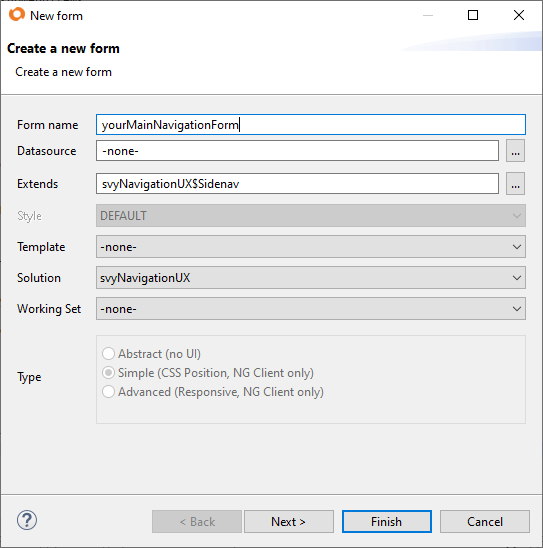
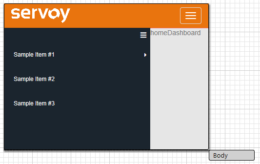

# svyNavigation

**Table of Contents**

* [Quick Start](./#quick-start)
  * [Init the Menu](./#init-the-menu)
  * [Init the Navbar](./#init-the-navbar)
* [\*New Templates](./#new-templates)
* [Global Search](./#global-search)
* [Navigation API](./#navigation-api)
  * [Open with Data Selection](./#open-with-data-selection)
  * [Open with Custom Data](./#open-with-custom-data)
* [Navigation Events](./#navigation-events)
* [Custom Navigation (no use of svyNavigationUX)](./#custom-navigation-no-use-of-svynavigationux)
* [Navigation History](./#navigation-history)

The svyNavigation module provides API and UX patterns for navigation.

This module svyNavigationUX provides ready to use single page navigation templates; is also extensible to allow for custom UI and even other UX patterns.

## Quick Start

Include the module svyNavigationUX as module of your solution. Navigation templates are available as base forms within the svyNavigationUX module.

* Create your single page navigation form extending the svyNavigationUX$Sidenav form available in svyNavigationUX module
* In your newly created navigation form, set the first form to be viewed as the containedForm of the _sidenav_ element.
* \[Optional] Customize the _navbar_ element adding your own brandlogo.





## Init the Menu

* Populate the menu items by overriding the base function _loadMenuItems_ and return your menu items list.

```
function loadMenuItems() {
	var menuItems = [];

	/** @type {CustomType<servoyextra-sidenav.MenuItem>} */
	var menuItem = new Object();
	menuItem.id = "homeDashboard";
	menuItem.text = "DASHBOARD"
	menuItem.iconStyleClass = "fa fa-th-large";
	menuItems.push(menuItem);

	// Customer page
	menuItem = new Object();
	menuItem.id = "customersTableView";
	menuItem.text = "CUSTOMERS"
	menuItem.iconStyleClass = "fas icon-contacts";
	menuItems.push(menuItem);
		
	// Order page
	menuItem = new Object();
	menuItem.id = "ordersTableView";
	menuItem.text = "ORDERS"
	menuItem.iconStyleClass = "icon-box";
	menuItems.push(menuItem);

        // return the menu items
	return menuItems;
}
```

## Init the Navbar

* Populate the navbar items by overriding the base function _loadNavbarItems_ and return your navbar items list.
* \[Optional] Add the INPUT or INPUT\_GROUP with itemId DEFAULT\_NAVBAR\_ACTIONS.SEARCH to enable the default global search.
* Override the onNavbarMenuItemClicked to handle custom actions from the navbar.

```
function loadNavbarItems() {
	var menuItems = [];

        // add default global search
	/** @type {CustomType<bootstrapextracomponents-navbar.menuItem>} */
	var menuItem = elements.navbar.createMenuItem('Search', DEFAULT_NAVBAR_ACTIONS.SEARCH, 'RIGHT');
	menuItem.displayType = 'INPUT_GROUP';
	menuItem.inputButtonStyleClass = "btn-default";
	menuItem.iconName = "fa fa-search";
	menuItems.push(menuItem);

	// user menu item
	menuItem = elements.navbar.createMenuItem('User', 'USER-SETTINGS', 'RIGHT');
	menuItem.displayType = 'MENU_ITEM';
	menuItem.iconName = 'fas fa-user';

        // add a sub-item
	var logoutMenuItem = elements.navbar.createMenuItem('Logout', 'LOGOUT');
	menuItem.subMenuItems = [logoutMenuItem];
	menuItems.push(menuItem);

	return menuItems;
}

// handle the custom actions event for the navbar
function onNavbarMenuItemClicked(event, menuItem) {

	switch (menuItem.itemId) {
	case 'LOGOUT':
		scopes.svySecurity.logout();
		break;
	default:
		break;
	}
}
```

## \*New Templates

Available since v1.2.0

The svyNavigationUX module currently comes with 3 different templates. Create your single page navigation form extending any of the following template form available in svyNavigationUX module.

* **svyNavigationUX$Sidenav** : standard template suitable for desktop and tablets.\
  It has a top Navbar and a Side Menu.
* **svyNavigationUX$SidenavMobile** : suitable for mobile platforms.\
  It has a Side menu which slides in and out from the side.\
  It's Side menu can be initiated following similar steps of [Init the Menu](./#init-the-menu).
* **svyNavigationUX$NavbarMobile** : suitable for mobile as well all other platforms.\
  It has a collapsible Navbar which can fit both on narrow mobile screens and larger desktop screens.\
  It's Navbar menu can be initiated following similar steps of [Init the Navbar](./#init-the-navbar).

To use any of the 3 templates, follow same steps from the Quick Start guide.

## Global Search

The Navbar may include an input field to be used as global search (see Init the Navbar above); the visible can register a listener for a global search trigger, this way the visible form can react to any user input from the search box in Navbar.

Make sure to remove the listener when the form is hidden.

```
function onShow(firstShow, event) {
	// listen for a global search event
	scopes.svyNavigationUX.addGlobalSearchListener(globalSearchListener);
}

function globalSearchListener(searchText) {
	// perform a search
}

function onHide(event) {
	// stop listening when hiding the form
	scopes.svyNavigationUX.removeGlobalSearchListener(globalSearchListener)
	return true
}
```

## Navigation API

Use the svyNavigation API to navigate between forms; create a NavigationItem object providing the name of the form you would like to navigate to. Navigate to such form calling the method scopes.svyNavigation.open(navigationItem); The svyNavigationUX template will react to the open event and replace the form visible in container with the new form the user is navigating to.

```
var item = new scopes.svyNavigation.NavigationItem(formName);
scopes.svyNavigation.open(item);
```

## Open with Data Selection

When navigating between forms is a common use case to load or select records in the destination form; therefore data do be loaded and data selection type can be specified in the _open_ API. Using one of the svyNavigationUX template the data will be loaded in the destination form based on the given dataSelectionType;

```
var item = new scopes.svyNavigation.NavigationItem(formName);
scopes.svyNavigation.open(item,foundset.getSelectedRecord(),scopes.svyNavigation.NAVIGATION_SELECTION_TYPE.LOAD_RECORDS);
```

Possible dataSelectionTypes:

* **LOAD\_RECORDS** This is the DEFAULT selection type. Will run foundset.loadRecords(dataToShow) on the form to be shown.\
  Load records into the form's foundset. If you load a relation into this foundset, then this foundset will not be a related foundset, it will not automatically update its state of records are updated or added that belong to that relation. It will only be a snapshot of that related foundsets state. Foundset filter params are copied over from the source foundset and are merged with the existing filters on this foundset.
* **SET\_FOUNDSET** Can be used only when the dataToShow is of type JSFoundSet. Will run controller.loadRecords(dataToShow) for the target form.\
  Replace the default form's foundset with setting the (related) foundset into the form. The form will no longer share the default foundset with forms of the same datasource, use loadAllRecords to restore the default foundset. This will really update the foundset instance itself of the form, so now existing foundset is altered just the new foundset is shown. When the form uses a seperate foundset, foundset filter params are copied over from the source foundset and are merged with the existing filters.
* **SELECT\_RECORD** Can be used only when the dataToShow is a JSRecord. Selects the record with the given pk in the foundset even if the record is not loaded in foundset yet. **Warning**: can be very expensive, as the entire foundset may needs to be loaded. Returns false if the record cannot be found in the entire foundset.
* **FORCE\_SELECT\_RECORD** Can be used only when the dataToShow is a JSRecord. Selects the record with the given pk in the foundset even if the record is not loaded in foundset yet. **Warning**: can be very expensive, as the entire foundset may needs to be loaded. Returns false if the record cannot be found in the entire foundset. If the record is not present in the foundset will force the selection by loading all records into the foundset. If there are active foundset or table filters these won't be removed, they will still apply.

## Open with Custom Data

Another common use case when navigating between form is to pass custom data to the destination form. Custom data can be added into the opened NavigationItem and can be used by the opened form. The customData accepts any custom JSON object. Consume the custom data at the onShow of the destination form.

```
var item = new scopes.svyNavigation.NavigationItem("ordersTableView");
item.setCustomData({ filter: { dataprovider: "orderdate", operator: "between", values: [startDate, endDate] } });
scopes.svyNavigation.open(item);

// consume the custom data at the onShow of the destination form
function onShow() {
        // get the current navigation item
	var item = scopes.svyNavigation.getCurrentItem();
	var customData = item.getCustomData();
	if (customData && customData.filter) {
		var filter = customData.filter;
		foundset.addFoundSetFilterParam(filter.dataprovider, filter.operator, filter.values);
	        foundset.loadRecords();
	}
}
```

## Navigation Events

The navigation is event driven; the open API will trigger two events types, a BEFORE\_CLOSE event for the navigation item being closed (if any) and an AFTER\_OPEN event for the navigation item opened. It is possible to subscribe to the Navigation Events, if any subscriber returns _false_ during the BEFORE\_CLOSE event the navigation will be cancelled. The templates from the svyNavigationUX will react to the AFTER\_OPEN event and will switch the visible form in template.

A common use case is to prevent any navigation if the current form has pending record edits or invalid data. Your form can subscribe for the Navigation Event and return false at the BEFORE\_CLOSE if there are pending edits not saved yet. Make sure to remove the subscription when the form is hidden.

```
// register for navigation event at the onShow
scopes.svyNavigation.addNavigationListener(onOpen);

function onOpen(event) {
    if (event.getEventType() == scopes.svyNavigation.NAVIGATION_EVENT.BEFORE_CLOSE) {
        if (databaseManager.getEditedRecords().length) {
            return false;   // or ask with a dialog
        }
    }
    return true;
}

// de-register navigation event at the onHide
scopes.svyNavigation.removeNavigationListener(onOpen);
```

## Custom Navigation (no use of svyNavigationUX)

If you are not using none of the navigation template from svyNavigationUX you will need to register for the Navigation Event and react to the AFTER\_OPEN event to switch the visible form.

```
// register for navigation event
scopes.svyNavigation.addNavigationListener(onOpenHandler);

function onOpenHandler(event) {
    if (event.getEventType() == scopes.svyNavigation.NAVIGATION_EVENT.AFTER_OPEN) {
        // load data into form
        forms[item.getFormName()].foundset.loadRecords(event.getDataToShow());
        // show form
        application.showForm(item.getFormName());
    }
}
```

## Navigation History

The Navigation Items the user has navigated to are tracked in a history stack. Is possible to navigate back and forth the Navigation Items in history using the svyNavigationHistory scope API.

```
	// set max history: default 500
	scopes.svyNavigationHistory.setMaxHistoryLength(100);

	scopes.svyNavigationHistory.historyBack();
	scopes.svyNavigationHistory.historyNext();

```
