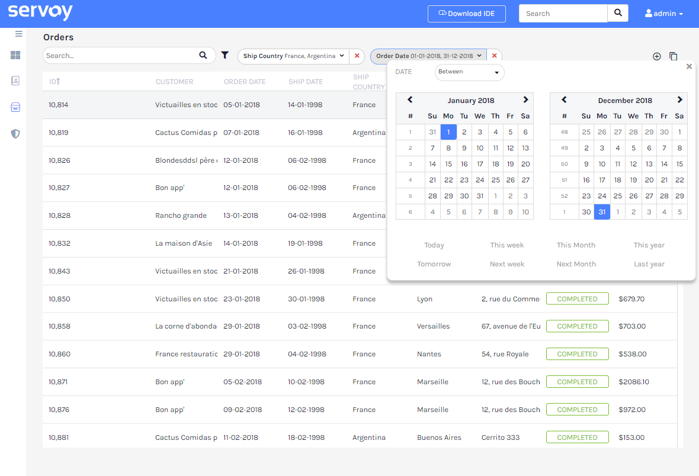
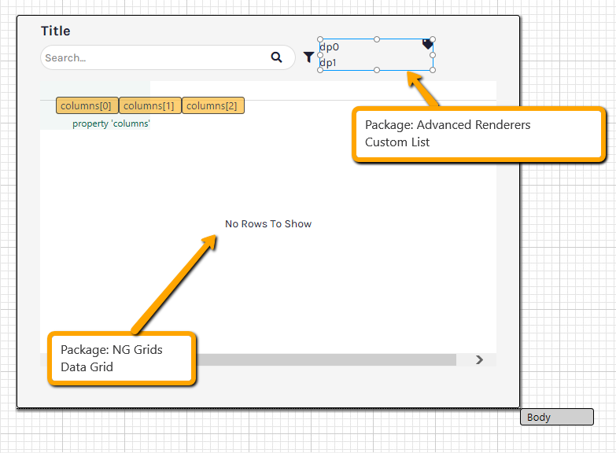
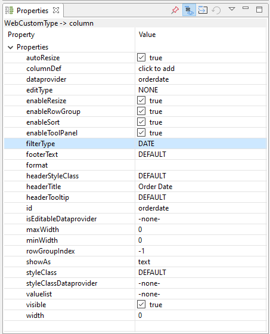

# svyPopupFilter

### Overview

### Table of Contents

* [Quick Start](./#quick-start) - [Grid Setup](./#grid-setup) - [Init Toolbar Object](./#init-toolbar-object)
* [Free Search](./#free-search) - [Free Search Usage](./#free-search-usage) - [Free Search Custom Configuration](./#free-search-custom-configuration)
* [Calculation & Cross DB](./#calculation-and-cross-db)
* [Additional Filters](./#additional-filters)
  * [Add Filters](./#new-additional-filters) **NEW**
  * [Alter Filters](./#new-alter-filters) **NEW**
* [Persist Toolbar State](./#persist-toolbar-state)
* [Properties](./#properties) - [Auto Apply](./#auto-apply) - [Default Operator](./#default-operator) - [Use only visible columns](./#use-only-visible-columns)
  * [Date display format](./#new-date-display-format)
* [Events](./#events) - [onFilterApplyEvent](./#onfilterapplyevent) - [onFilterRemovedEvent](./#onfilterremovedevent)
* [Custom Search](./#custom-search) - [onSearchCommand](./#onsearchcommand)
  * [onFilterApplyQueryCondition](./#new-onfilterapplyquerycondition) **NEW**
* [Locale](./#new-locale) **NEW**
* [Icons](./#new-icons) **NEW**
* [Custom Templates](./#custom-templates)
* [Custom Filters](./#custom-filters)
* [Stand-alone Filter Pickers](./#stand-alone-filter-pickers)

The svyPopupFilter module provides UX patterns for table filters and other generic filter lookups. It can be used in combination with the latest NG Data Grid component providing built-in filter capabilities.

This module provides out-of-the-box poup filters and a toolbar implementation, but is also extensible to allow for other UI types and UX patterns.

### Example



## Quick Start

It takes just a few components and few lines of code to configure a robust toolbar filter for an NG Grid table. You should add into your form the following elements:

* A Data Grid component from the NG Grids Package; The filter toolbar will rely on the columns configuration of the grid.
* A Custom List component from the Advanced Renderers Components Package; Will be used by the filter toolbar to render the active filters.
* A clickable element used to show the filters picker when clicked (e.g. a clickable icon)
* (Optional) a textbox to enhance the toolbar filter with a free search.



#### Grid Setup

The available filters in toolbar depends on the configuration of the columns in the Data Grid. Every visible column in grid having a dataprovider and the property _filterType_ set to TEXT, DATE, NUMBER or RADIO will be available in the filters toolbar. Each filterType will have it's specific UX depending on the column's settings.

* [Token](simple-filter-pickers.md#tokens): filterType=TEXT
* [Integer|Number](simple-filter-pickers.md#integer-or-number-range): filterType=NUMBER _is automatically resolved to an Integer or Number filter type depending on the column's dataprovider type_
* [Date](simple-filter-pickers.md#date-range): filterType=DATE
* [Check](simple-filter-pickers.md#check): filterType=RADIO
* [Multi Select](simple-filter-pickers.md#multi-select): when the column has a valuelist.

Note: the column dataprovider must be an existing column in the datasource or in a related datasource. Cannot be a calculation or an aggregation.



#### Init Toolbar Object

Finally write few lines of code to init the toolbar filter. Create a form variable to hold the toolbarFilter object; init the toolbarFilter object at the onLoad of your form; show the filter picker from any event of your convenience to let the user activate any filter; propagate the click event from the Custom List component used to render the active filter to the toolbarFilter object to let it do it's magic. Optionally combine the toolbar filter with a free input search.

```
// Create a form variable to hold the toolbarFilter object
/** 
 * @type {scopes.svyToolbarFilter.ListComponentFilterRenderer}
 */
var toolbarFilter;

// init the toolbarFilter object at the onLoad
function onLoad(event) {
	toolbarFilter = scopes.svyToolbarFilter.createFilterToolbar(elements.customlist, elements.table);
}

// action to show the filter picker; trigger it from any UI element of your choice (.e.g filter icon)
function onActionPickFilter(event) {
	// make sure the element's name property is set; unnamed elements cannot be target
	toolbarFilter.showPopupFilterPicker(elements[event.getElementName()])
}

// action to show a specific filter popup. The onClick event of the ListComponent
function onListComponentClick(entry, index, dataTarget, event) {
        // propagate the onClick event into the toolbarFilter object to show the filter popup
	toolbarFilter.onClick(entry, index, dataTarget, event);
}

// combine the toolbar filter with a free searchbox
function onActionSearch(event) {
	toolbarFilter.setSearchText(searchText);
	toolbarFilter.search();
}
```

#### disable default NG Grid filters

Making use of the Advanced Toolbar Filters, the default filters of the NG Grid are redundant; you can therefore decide to disable the filters of the NG Grid and let the user use exclusively the toolbar filters.

You can disable the default filters of the NG grid by adding this option to each column in the columns's columnDef property : `menuTabs: ['generalMenuTab']`

In case you want to show the columnsMenuTab in the column menu you can set the menuTabs option as following: `menuTabs: ['generalMenuTab', 'columnsMenuTab']`

You can suppress the filter tool panel on the side by setting `suppressColumnFilter = true` in the toolPanelConfig of the grid.

**Disable default NG Grid filters globally**

The steps above will be tedious to be applied for all grids and all columns of your grid. You can instead apply these settings globally to all the NG Grids of your active solution; you can do so by using the Servoy NG Grid Services ( you can download them from the NG Services section of the Web Package Manager ). At the onSolutionOpen you can use the nggridservices to apply a default config to all grids.

```
// set up tool panel options 
var toolPanelOptions = plugins.ngDataGrid.createToolPanelConfig(); 
toolPanelOptions.suppressColumnFilter = true; 
plugins.ngDataGrid.toolPanelConfig = toolPanelOptions;
 
// set up default column properties
plugins.ngDataGrid.columnOptions = { menuTabs: ['generalMenuTab'] }
```

## Free Search

As described in the [Quick Start](./#quick-start), the filter toolbar can be combined with a free input search. The free search will run against all visible columns of the grid having a dataprovider or a related dataprovider. The free search is based on the Servoy's [svySearch](../home-5.md);

**Example**

```
john -smith   // matches "John Doe" and "Suxy Johnson" but not "John Smith"
+john         // matches "John Doe", but not "Suzy Johnson"
freight:>100  // matches any freight greater than $100
freight:>=100 // matches any freight greater or equal to $100
order-date:<01-01-1997  // matches any date less than 01-01-1997
order-date:<=01-01-1997  // matches any date less than or equal to 01-01-1997
order-date:01-01-1997...12-31-1997  // matches any date during the year of 1997
```

#### Free Search Usage

The toolbar filter object will create a simple search using as search providers the dataproviders of the visible columns (by design) in the grid component. The [alias](../home-5.md) will be based on the headerTitle, if any, otherwise is defaulted to the dataprovider name; white spaces will be removed from the alias name. **Example**: a column with headerTitle "Order Date" will have alias "orderdate"

All columns (except for dataprovider of type Date) are defaulted to impliedsearch = true; for columns with a valuelist [substitutions](../home-5.md) are generated based on the valuelist displaValue/realValue (except for valuelist based on related tables or global methods).

```
        // run a free search across all columns
	toolbarFilter.setSearchText(searchText);
	toolbarFilter.search();
```

#### Free Search Custom Configuration

The toolbar filter offers programmable API allowing customization of the Free Search behavior; for instance is possible to configure the dateFormat to be used in search or add new search providers which are not available in the grid design

```
	var simpleSearch = toolbarFilter.getSimpleSearch();
	// set date format to be used in free search
	simpleSearch.setDateFormat("dd/MM/yyyy");
	// add a search provider not available in grid
	simpleSearch.addSearchProvider("orders_to_customers.customerid", "customerid", false);
```

Is also possible to customize the behavior of any searchProvider tied to a grid column

```
	// change column 3 to explicit search
	var column = elements.table.getColumn(3);
        toolbarFilter.getSearchProvider(column).setImpliedSearch(false);
```

## Calculation & Cross DB

As mentioned above in the [Grid Setup](./#grid-setup) the toolbar filter can be enabled for any existing column in datasource or related datasource. The column should be a queryable column for the datasource; the filter cannot query a non stored calculation, an aggregation or a related dataprovider using a cross database relation.

However you will be able to alter the filter programmatically or to define on your own the query criteria for columns non queryable by default. Read the sections below on [onFilterApplyQueryCondition](./#new-onfilterapplyquerycondition) and [additional filters](./#additional-filters).

## Additional Filters

Is possible to alter the toolbar filter programmatically, adding or altering filters.

#### \***NEW** Additional Filters

Available since v2.0.0

Sometimes the dataprovider to be filter on aren't available in the grid as a column. Is possible to add additional filters programmatically using the addFilter API.

```
	toolbarFilter.addFilter("Postal Code", "shippostalcode", scopes.svyToolbarFilter.FILTER_TYPES.TOKEN)
	toolbarFilter.addFilter("Employee", "employeeid", scopes.svyToolbarFilter.FILTER_TYPES.SELECT)
		.setValueList("employess")
		.setUseInSearch(false);
```

#### \***NEW** Alter Filters

Available since v2.0.0

Since version 2.0.0 is possible to alter the setup of specific filters programmatically; is possible to enable a valuelist for the filter.

```
	toolbarFilter.getFilter("shipcountry").setValueList("shipCountries");
	toolbarFilter.getFilter("shipcity").setValueList("shipCities");
```

## Persist Toolbar State

A common feature request is to store the active filters per user. The toolbar state can be persisted into a serializable JSON object and can be restored any moment using the toolbar object API.

```
	// persist the filter state
	var filtersState = toolbarFilter.getToolbarFiltersState();
	var key = controller.getName() + "." + elements.table.getName();
	application.setUserProperty(key, JSON.stringify(filtersState));


	// restore the filter state
	var key = controller.getName() + "." + elements.table.getName();
	// get the filter state as a JSON
	var filtersState = application.getUserProperty(key);
	toolbarFilter.restoreToolbarFiltersState(JSON.parse(filtersState));
```

## Properties

You can set the following properties for toolbar object:

#### Auto Apply

As default behavior the toolbar filters the data as soon there is a change in the filters, which would happen after a filter popup has been dismissed; however for large tables the query to search data may take some seconds. In such scenario filtering the data at every change may provide a disruptive experience to the user; would be ideal instead to let the user control when it's time to apply the filter; you can therefore change the default behavior of the toolbar by setting the autoApplyFilters to false and create your own button the user can click to filter data with the active filters.

```
function onLoad(event) {
	toolbarFilter = scopes.svyToolbarFilter.createFilterToolbar(elements.filterToolbar, elements.table);
	toolbarFilter.setAutoApplyFilters(false);
}

function onActionApply(text) {
	toolbarFilter.search();
}

```

#### Default Operator

Available since v1.1.0

Is possible to change the default operator used by the filters using the global setting _setPopupDefaultOperator_. Each filter type can make use of a different set of operators; user enum scopes.svyPopupFilter.OPERATOR for available options. Specifically

* TOKEN: IS\_IN(DEFAULT), LIKE, LIKE\_CONTAINS
* INTEGER: EQUALS(DEFAULT), BETWEEN, GREATER\_EQUAL, GREATER\_THEN, SMALLER\_EQUAL, SMALLER\_THEN
* NUMBER: EQUALS(DEFAULT), BETWEEN, GREATER\_EQUAL, GREATER\_THEN, SMALLER\_EQUAL, SMALLER\_THEN
* DATE: BETWEEN(DEFAULT), GREATER\_EQUAL, SMALLER\_EQUAL, EQUALS
* SELECT: IS\_IN(DEFAULT)
* CHECK : EQUALS

The TOKEN filter type used to search on TEXT fields by default will search for an exact match using the IS\_IN clause. Is possible to change such behavior into a LIKE for SEARCH\_WORD% or %SEARCH\_WORD% by changing the default operator to LIKE or LIKE\_CONTAINS.

```
// change default operator for TEXT token filters.
scopes.svyToolbarFilter.setPopupDefaultOperator(scopes.svyToolbarFilter.FILTER_TYPES.TOKEN, scopes.svyPopupFilter.OPERATOR.LIKE);
```

#### Use only visible columns

Available since v1.1.0

With the NG Grid either you either the user can configure the visible columns to be viewed in the grid. By default the toolbar filter will allow the user to search across columns despite if the column is visible or not for the user. You can instruct the toolbar filter to pick the visible columns for filtering by _setConfigUseNonVisibleColumns(false)_.

NOTE: this option will affect only the filter picking list; will not discard existing filters in case the visibility of a column is toggled to false.

NOTE: the Free Search always search across the visible columns set at design time, does not include or ignore columns when visibility is changed at runtime

```
// when set to false allow the user to pick only visible columns in the toolbar filter
scopes.svyToolbarFilter.setConfigUseNonVisibleColumns(false);
```

#### \***NEW** Date display format

Available since v1.2.0

Is possible to change the default display format for Dates using the global setting _setConfigDateDisplayFormat_. The display format affects how dates are displayed in the filter toolbar. Default value: 'dd-MM-yyyy'

```
// Sets global display date format to be used
scopes.svyToolbarFilter.setConfigDateDisplayFormat("dd/MM/yyyy");
```

## Events

You can subscribe to the following toolbar object events:

#### onFilterApplyEvent

This event is triggered any time a filter is applied; a common use case is to update the persisted toolbar filter state any time a filter is applied.

```
	// register for the onFilterApplyEvent
	toolbarFilter.setOnFilterApplyCallback(onFilterApplyEvent);

function onFilterApplyEvent(values, operator, filter) {
	// persist the filter state
	var filtersState = toolbarFilter.getToolbarFiltersState();
	var key = controller.getName() + "." + elements.table.getName();
	application.setUserProperty(key, JSON.stringify(filtersState));
}

```

#### onFilterRemovedEvent

This event is triggered any time a filter is removed from the active filters; a common use case is to update the persisted toolbar filter state any time a filter is removed.

```
	// register for the onFilterRemovedEvent
	toolbarFilter.setOnFilterRemovedCallback(onFilterRemovedEvent);

function onFilterRemovedEvent() {
	// persist the filter state
	var filtersState = toolbarFilter.getToolbarFiltersState();
	var key = controller.getName() + "." + elements.table.getName();
	application.setUserProperty(key, JSON.stringify(filtersState));
}

```

:exclamation: NOTE: in the samples above the filter state is stored as browser cookie using the application.setUserProperty; as best practice is recommended to store the state somewhere else (e.g. physical table), where it can be accessed from any device and not be limited to the browser cache. You may consider using the [svyProperties API](../home-6/svyproperties.md).

```
function onFilterApplyEvent(values, operator, filter) {
	// persist the filter state in table using svyProperties
	var filtersState = toolbarFilter.getToolbarFiltersState();
	var key = controller.getName() + "." + elements.table.getName();
        scopes.svyProperties.setUserProperty(key, 'filter-state', JSON.stringify(filtersState));
}

function onFilterRemovedEvent() {
	// persist the filter state in table using svyProperties
	var filtersState = toolbarFilter.getToolbarFiltersState();
	var key = controller.getName() + "." + elements.table.getName();
        scopes.svyProperties.setUserProperty(key, 'filter-state', JSON.stringify(filtersState));
}
```

## Custom Search

Sometimes you may need to apply extra conditions or perform custom actions any time the toolbar filter is applied. The search perfomed by the toolbar filter can be customized by setting the onSearchCommand for the toolbar filter object. Set the onSearchCommand function to fully override the search behavior; for example you can add custom conditions to the query object generated by the toolbar filter. You will be responsible to apply the query into the given foundset.

#### onSearchCommand

```
	// set the onSearchCommand
	toolbarFilter.setOnSearchCommand(onSearchCommand)

function onSearchCommand(query, fs) {
	// add custom conditions to the query
	query.where.add(query.columns.orderdate.not.isNull);

	// apply the query to the foundset
	fs.loadRecords(query);
}
```

#### \***New** onFilterApplyQueryCondition

Available since v2.0.0

Certain dataproviders, such as calculations & aggregations, cannot be queried; therefore the filter won't be able to generate a query for these columns. Using the onFilterApplyQueryCondition event you can add your own criteria to the generated QBSelect on specific filters. You can intercepts the filter query for calculated columns or aggregations and define the query criteria yourself.

Sets a callback method that is fired whenever a query for a given filter is applied This can be used to either modify the filter before the query is created or to enhance the provided QBSelect yourself To prevent the filter from adding criteria to the query as it would normally do, the method being called can return false.

```
toolbarFilter.getFilter("orderStatus").setValueList("orderStatuses");
toolbarFilter.setOnFilterApplyQueryCondition(onFilterQueryCondition);

function onFilterQueryCondition(query, dataprovider, operator, values, filter) {
	if (!values || !values.length) return true;

	switch (dataprovider) {
	case "orderStatus":

		var or = query.or;

		// no requireddate set
		if (values.indexOf("new") > -1) {
			or.add(query.columns.requireddate.isNull)
		}

		// only requireddate is set
		if (values.indexOf("planned") > -1) {
			or.add(query.and.add(query.columns.requireddate.not.isNull).add(query.columns.shippeddate.isNull))
		}

		// requireddate & shippedate are set
		if (values.indexOf("completed") > -1) {
			or.add(query.and.add(query.columns.requireddate.not.isNull).add(query.columns.shippeddate.not.isNull))
		}

		query.where.add(or);

		return false;
		break;
	case "order_total":
		
		var isin = datasources.db.example_data.orders.createSelect();
		isin.result.addPk();

		var column = isin.joins.orders_to_order_details.columns.unitprice.multiply(isin.joins.orders_to_order_details.columns.quantity).sum;

		switch (operator) {
		case "between":
			isin.groupBy.add(isin.columns.orderid);
			isin.having.add(column.between(values[0], values[1]));
			break;
		default:
			isin.groupBy.add(isin.columns.orderid);
			isin.having.add(column[operator](values[0]));
			break;
		}

		// filter orderid having order_total within filter values
		query.where.add(query.columns.orderid.isin(isin));

		return false;
		break;
	default:
		break;
	}
	return true;
}
```

## \***New** Locale

Available since v2.0.0

The svyPopupFilter module is shipped without a resource project; thefore doesn't come with predefined internationalized keys [i18n](https://wiki.servoy.com/display/DOCS/Internationalization+-+I18N). Since version 2.0.0 is possible to set programmatically the localized text for the default filter [templates](./#custom-templates). Use the LOCALE object from the svyPopupFilter scope to override the default texts.

```

function onSolutionOpen() {
  // set localized text
  // filter menu
  scopes.svyPopupFilter.LOCALE.filterPopupMenu.addFilter = i18n.getI18NMessage("addfilter");
  // token filter
  scopes.svyPopupFilter.LOCALE.svyTokenPopupFilter.labelRemoveAll = i18n.getI18NMessage("removeall");
  // select filter
  scopes.svyPopupFilter.LOCALE.svySelectPopupFilter.labelDeselectAll = i18n.getI18NMessage("deselectall");
  // check filter
  scopes.svyPopupFilter.LOCALE.svyCheckPopupFilter.labelChecked = i18n.getI18NMessage("yes");
  // number filter
  scopes.svyPopupFilter.LOCALE.svyNumberPopupFilter.labelEqualTo = i18n.getI18NMessage("equalto");
  // integer filter
  scopes.svyPopupFilter.LOCALE.svyIntegerPopupFilter.labelEqualTo = i18n.getI18NMessage("equalto");
  // date filter
  scopes.svyPopupFilter.LOCALE.svyDatePopupFilter.labelToday = i18n.getI18NMessage("today");
  //...
}
```

The locale will be applied to the default UI templates as well to custom templates which inherits from it.

## \***New** Icons

Available since v2.0.0

Since version 2.0.0 is possible to set programmatically the icons for the default filter [templates](./#custom-templates). Use the STYLING object from the svyPopupFilter scope to override the default icons and style. Can use as icon any font icon (e.g. FontAwesome).

```
function onSolutionOpen() {
	scopes.svyPopupFilter.STYLING.CLOSE_ICON = "fa fa-times"
	scopes.svyPopupFilter.STYLING.EXCLUDE_ICON = "fas fa-minus-circle"
	scopes.svyPopupFilter.STYLING.INCLUDE_ICON = "fas fa-check-circle"
	scopes.svyPopupFilter.STYLING.OPEN_FILTER_ICON = "fas fa-angle-down"
	scopes.svyPopupFilter.STYLING.REMOVE_FILTER_ICON = "fas fa-trash"
	scopes.svyPopupFilter.STYLING.REMOVE_ICON = "fas fa-times"
	scopes.svyPopupFilter.STYLING.MULTI_SELECT_SHOW_TILE_HEADERS = true;
	scopes.svyPopupFilter.STYLING.MUTLI_SELECT_ICON_COLUMN_WIDTH = '50'
```

## Custom Templates

The toolbar filter offers a default UI template (Form Renderer) for each filter type (TEXT, INTEGER, NUMBER, DATE, SELECT, CHECK); you can implement your custom UI template and you can configure the toolbar filter to use your own template. See the section [Custom Templates](custom-templates.md) to learn how to create custom templates for the toolbar filter.

```
// TEXT filterType
scopes.svyToolbarFilter.setPopupRendererForm(scopes.svyToolbarFilter.FILTER_TYPES.TOKEN, forms.svyTokenPopupFilter);
// INTEGER filterType
scopes.svyToolbarFilter.setPopupRendererForm(scopes.svyToolbarFilter.FILTER_TYPES.INTEGER, forms.svyIntegerPopupFilter);
// NUMBER filterType
scopes.svyToolbarFilter.setPopupRendererForm(scopes.svyToolbarFilter.FILTER_TYPES.NUMBER, forms.svyNumberPopupFilter);
// DATE filterType
scopes.svyToolbarFilter.setPopupRendererForm(scopes.svyToolbarFilter.FILTER_TYPES.DATE, forms.svyDatePopupFilter);
// MULTI-SELECT filterType
scopes.svyToolbarFilter.setPopupRendererForm(scopes.svyToolbarFilter.FILTER_TYPES.SELECT, forms.svySelectPopupFilter);
// CHECK filterType
scopes.svyToolbarFilter.setPopupRendererForm(scopes.svyToolbarFilter.FILTER_TYPES.CHECK, forms.svyCheckPopupFilter);
```

## Custom Filters

For some specific columns you may want to use a custom filter instead of the pre-defined filter types; you can make sure the toolbar filter will use your custom filter in such scenario by returning a custom filter of your own in the onFilterCreate event.

**Example** For example you can create a distinct list of country based on your foundset data to be used as multi select filter.

```
toolbarFilter.setOnFilterCreate(onToolbarFilterCreate);

/**
 * @param {CustomType<aggrid-groupingtable.column>} column
 *
 * @properties={typeid:24,uuid:"468ED6CB-7CDF-4EE4-905A-EC1EF5030032"}
 */
function onToolbarFilterCreate(column) {
    if (!column || column.dataprovider != 'country') {
        // return null to use the default filter
        return null;
    }
    
    //distinct query for the value
    var qbSelect = databaseManager.createSelect(elements.table.myFoundset.foundset.getDataSource());
    qbSelect.result.add(qbSelect.getColumn(column.dataprovider), 'displayvalue');
    qbSelect.result.distinct = true;
    qbSelect.sort.add(qbSelect.getColumn(column.dataprovider).asc);
    
    //create lookup and set form provider
    var viewFsLookup = scopes.svyLookup.createQueryLookup(qbSelect, foundset.view_name + '_' + column.dataprovider);
    viewFsLookup.setLookupForm(forms.svySelectPopupFilter);
    
    //set proper header title for field
    var lookupField = viewFsLookup.getField(0);
    lookupField.setTitleText(column.headerTitle ? column.headerTitle : column.dataprovider);
    
    //create default select filter with that lookup
    return scopes.svyPopupFilter.createSelectFilter('displayvalue', viewFsLookup);
}
```

## Stand-alone Filter Pickers

The popup filters in use by the filter toolbar can also be used as stand-alone simple filters and pickers. The scope svyPopupFilter provides UX patterns with a variety of PopUp/Dialog pickers such as dates range picker, number range picker and multi-select picker. Learn more in the dedicated [wiki](simple-filter-pickers.md) section.
