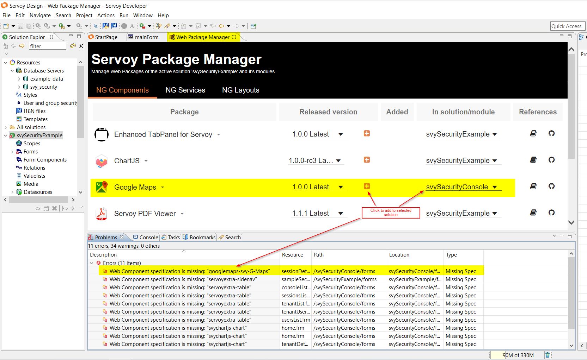
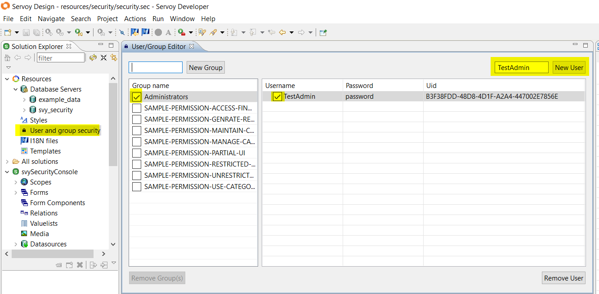
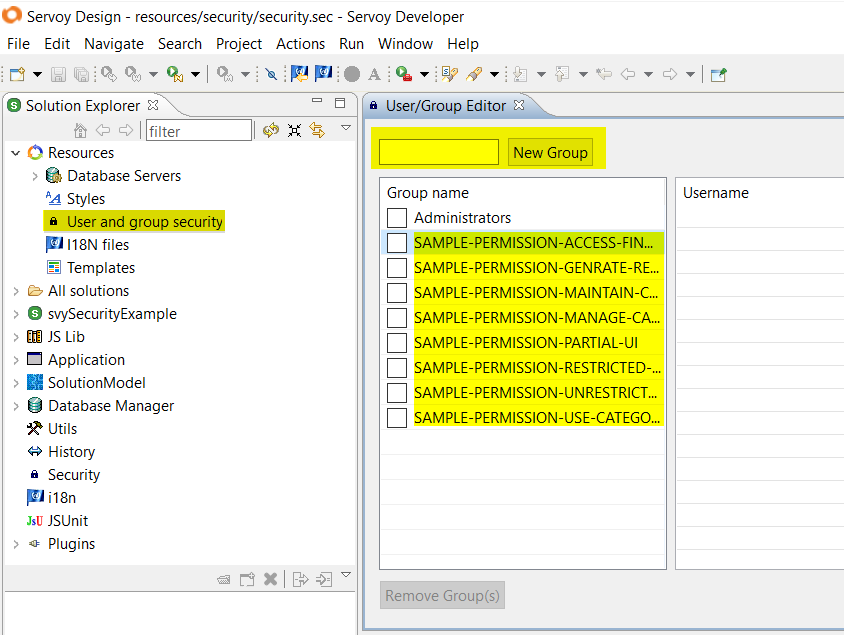
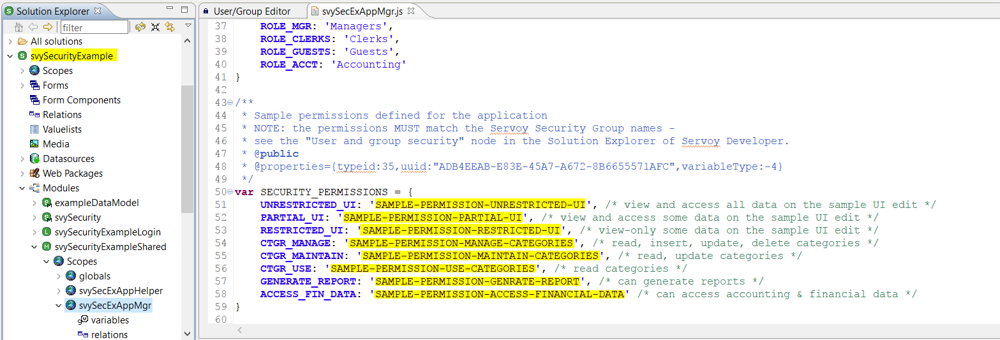

# Getting Started

The easiest way to get started with **svySecurity** is to download and import the \*.servoy file of the example solution **svySecurityExample**. It includes everything needed to get you going:

* the core module **svySecurity**
* the example solution **svySecurityExample** which provides samples of what the **svySecurity** can do and how it can be used
* a ready-to-use administration console solution [**svySecurityConsole**](security-management-console/) which can be used for handling the security-related administration tasks

The \*.servoy files available for download and import into Servoy Developer come in two "flavors" - for Servoy 8.1x and Servoy 8.2x respectively. Be sure to download the correct file for the Servoy version which you have installed. Servoy 8.14 and later are supported.

#### Importing the example solution in Servoy 8.1x

1. Create a new workspace.
2. Create a new empty database **svy\_security**.
3. Create new empty database **example\_data**.
4. Import the **svySecurityExample** solution using the file **svySecurityExample\_81x.servoy**. On the import dialog be sure to select the option **Allow data model (database) changes** - this will create the necessary tables in the empty databases created above. When prompted to import sample data contained in the import accept the data import.
5. After the import is finished, activate the solution **svySecurityExample** and open the **Web Package Manager** then add the following components for the respective solutions:
   * **Google Maps** (for solution **svySecurityConsole**)
   * **Servoy Extra Components** (for solutions **svySecurityExample** AND **svySecurityConsole** - you will need to activate each individual solution and add the web package for each solution)
   * **ChartJS** (for solution **svySecurityConsole**)

#### Importing the example solution in Servoy 8.2x

1. Create a new workspace.
2. Create a new empty database **svy\_security**.
3. Create a new empty database **example\_data**.
4. Import the **svySecurityExample** solution using the file **svySecurityExample\_82x.servoy**. On the import dialog be sure to select the option **Allow data model (database) changes** - this will create the necessary tables in the empty databases created above. When prompted to import sample data contained in the import accept the data import.
5. As part of the solution activation Servoy 8.2 will detect any required web packages and will prompt you to install them automatically. Accept the installs by clicking the button **"Automatic install"** at the prompts.

#### Adding administrator user for access to the Security Management Console

The solution **svySecurityConsole** requires a standard Servoy security user member of the built-in Administrators group (the same as for accessing the Servoy Application Server admin page). Here are the steps to create one in Servoy Developer:

1. In Solution Explorer -> Resources open the **User and group security** editor.
2. Create a new user, specify a password and save it.
3. Add the new user to the built-in **Administrators** group by selecting the **Administrators** group and checking the checkbox of the created user and then save again the changes.

#### Credentials for accessing the Security Example solution

The **svySecurityExample** solution uses the new tenant and user accounts managed by the **svySecurity**. Several example tenants, users, roles and permissions are included with the data in the import.

Below are the credentials for the sample users for the **svySecurityExample** solution included in the example data:

Tenant: **AcmeSol**

| User     | Password |
| -------- | -------- |
| pat      | 123      |
| terry    | 123      |
| visitor1 | 123      |

**Note:** The **svySecurityExample** solution provides on its login page an option to recreate the sample security data. This option will clear all security-related data in the **svy\_security** database and will generate again sample tenants, users, roles and historical user session data.

#### Permissions in svySecurity

The **svySecurity** uses the classic/standard Servoy security groups as **permissions**. This allows for standard design-time security configuration in Servoy Developer. For this purpose, for every svySecurity permission defined and used in an application, a corresponding standard Servoy security group must be created. These groups/permissions should be created at design-time using the "User and group security" editor in Servoy Developer. The names of the groups must match exactly the permission names. An example of this and its usage can be seen in the **svySecurityExample** solution.

 
