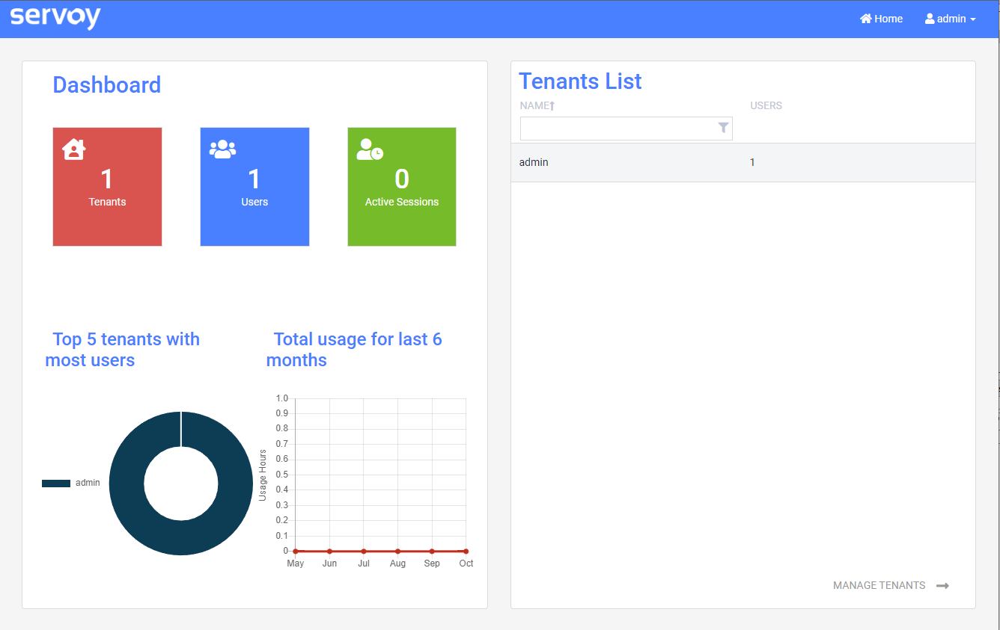

# Security Management Console

The svySecurity has a companion administration console, svySecurityConsoleUX, which provides out of the box intuitive options for all security-related administration tasks along with some useful summary and usage statistics. This modern svySecurityConsoleUX deprecates the former [svySecurityConsole](classic-security-management-console.md).

Only users that are members of the built-in Servoy security Administrators group can access the Security Management Console. You can create administrator user accounts on the [Servoy Application Server admin page](https://wiki.servoy.com/display/public/DOCS/Servoy+Admin+Page). You can learn more about [User and Group Security](https://wiki.servoy.com/display/DOCS/Defining+User+and+Group+Security).

## The Administration Console

### Home

Home page has an overview of registered Tenants and Users. Also provides detailed information for user sessions.

### Tenants

Manage Tenants in the Tenant List. Double click the Tenant to Manage the single Tenant.

 

### Roles

Manage the Roles for the Tenant and assign Permissions to Roles.

### Users

Manage the Tenant's User and Roles assignment.

 

## How to install the administration console

The svySecurityConsoleUX can be installed via the Solution section of the Servoy Web Package Manager.

