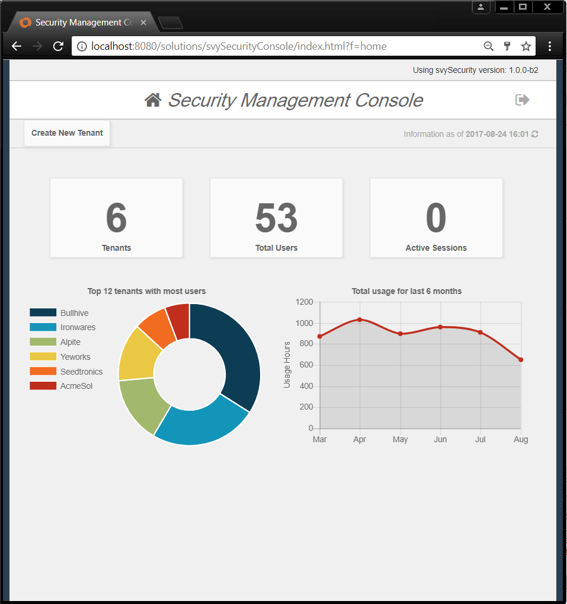
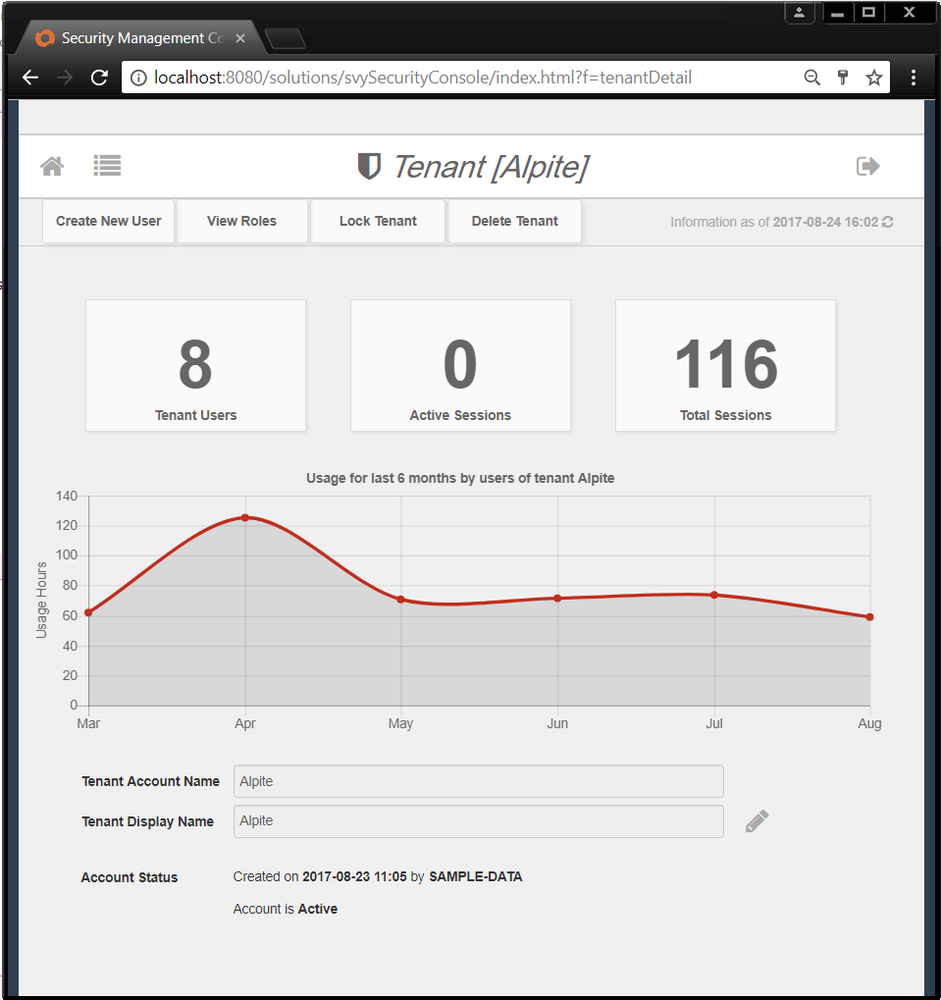
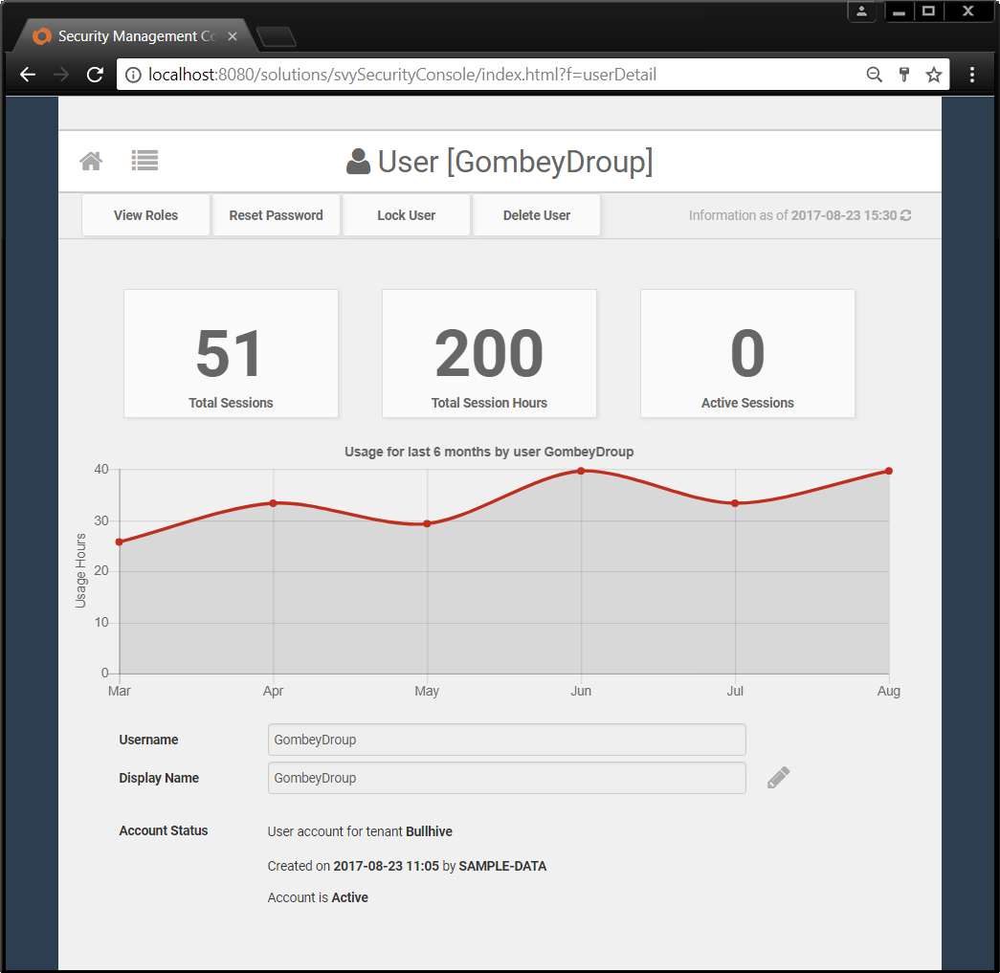
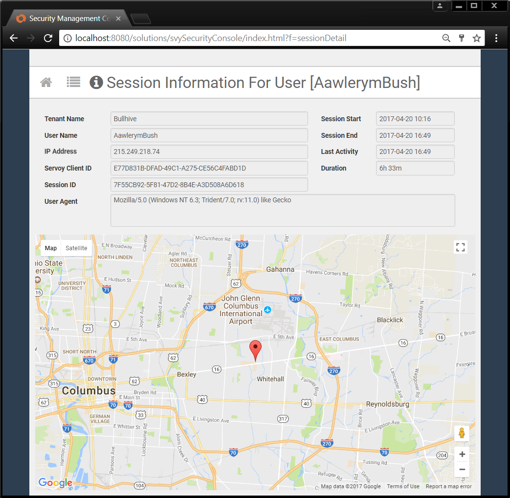
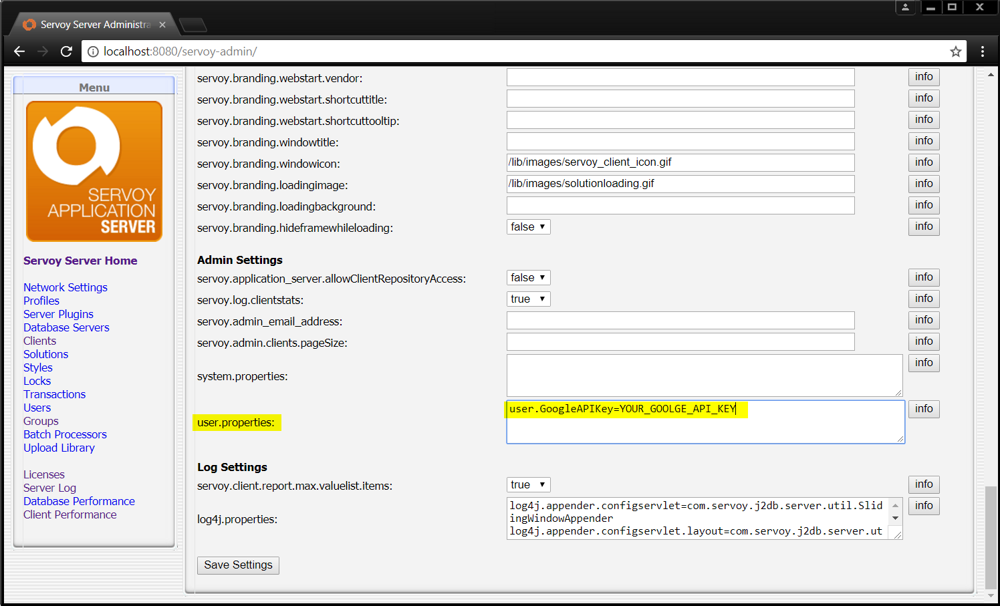

# Classic Security Management Console

_**Deprecated**_

The classic svySecurityConsole has been deprecated in favor of the modern [svySecurityConsoleUX](./)

The svySecurity has a companion administration console which provides out of the box intuitive options for all security-related administration tasks along with some useful summary and usage statistics.

  

Only users that are members of the built-in Servoy security Administrators group can access the Security Management Console. You can create administrator user accounts on the [Servoy Application Server admin page](https://wiki.servoy.com/display/public/DOCS/Servoy+Admin+Page).

The Security Management Console also provides detailed information for user sessions. It even includes a visual map with the approximate location associated with the client IP address.  For this purpose the console uses the [svyGMaps](https://github.com/Servoy/svyGMaps) compontent which **requires** a Google API Key. You can get one [here](https://developers.google.com/maps/documentation/javascript/get-api-key) for free and provide it to the Security Configuration Console by adding the following [user property](https://wiki.servoy.com/display/public/DOCS/Admin+Settings) on the Servoy App Server admin page:

**user.GoogleAPIKey=YOUR\_GOOGLE\_API\_KEY**

**Note:** After generating the Google API Key be sure to enable the Google Maps JavaScript API Service in your Google API Console.
