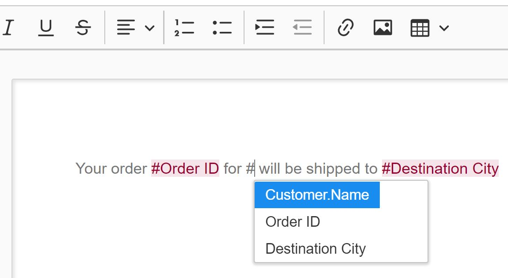

# Smart Doc Editor Utils

#### Contents

[Getting Started](smart-doc-editor-utils.md#getting-started)

[Custom Tag Libraries](smart-doc-editor-utils.md#custom-tag-libraries)

[Document Merge](smart-doc-editor-utils.md#document-merge)

[PDF Export](smart-doc-editor-utils.md#pdf-export)

[API Reference](smart-doc-editor-utils.md#api-reference)

***

### Getting Started

Servoy ships a [**Smart Doc Editor**](https://github.com/Servoy/smartDocumentEditor/wiki) component for rich in-app document editing. To compliment this component, we introduced this `svyUtils$documentEditor` module as part of the `SvyUtils` offering. This module provides additional utilities to manage custom tag libraries, document merge and PDF export.

Install the [Smart Doc Editor](https://github.com/Servoy/smartDocumentEditor/wiki) component via the Servoy Package Manager (SPM), if you have not already. `Help > Download Install with SPM` This is a required dependency.

Then install the `svyUtils$documentEditor` module, also via the SPM. (Choose the _"Modules"_ tab.) The module should be added as a dependency to your project, and the API will be available to you. You're ready to begin coding.

***

### Custom Tag Libraries

This module provides methods to embed custom data-bound tag libraries in the component with a simple API. The tags allow end users do design custom documents which can easily be [merged with data](smart-doc-editor-utils.md#document-merge). This gives the best experience for end-users, who won't need to understand anything about your database or your code.

_For more info on tag libs and how to set tags at design-time, please see the_ [_Smart Doc Editor_](https://github.com/Servoy/smartDocumentEditor/wiki) _wiki topic on **mention feeds**_.

#### Basic Example

```javascript
function createTags() { 
	
	// create editor object (stored as form variable)
	editor = scopes.svyDocEditor.getInstance(elements.editor);
	
	// setup tag library
	editor.tagBuilder(datasources.db.example_data.orders)
		.addField('orderid')
		.addField('shipcity')
		.addField('orders_to_order_details.quantity')
		.build()
}
```

As you can see, a [DocumentEditor](smart-doc-editor-utils.md#documenteditor) object was created and bound to the runtime component. Then a [TagBuilder](smart-doc-editor-utils.md#tagbuilder) object was then requested and bound to a specific data source `datasources.db.example_data.orders`. The tag builder can then generate field tags, using the [addField](smart-doc-editor-utils.md#addfield) method. Each field can be a primary or related `DataProvider` in the context of the tag builder's data source.

The list of available field tags is shown in a type-ahead selector whenever the `#` key is pressed. The result could look something like this:


#### Customize Tag Display Value

Each tag has a `displayValue`, which is what the user will see.

By default, the [TagBuilder](smart-doc-editor-utils.md#tagbuilder) will generate a default value based on the data provider. If it's a _real_ column in the tag builder's data source, the [JSColumn.title](https://wiki.servoy.com/display/DOCS/JSColumn#JSColumn-getTitle\(\)) property is used. If the title property is empty, or the data provider is derived (i.e. calculated or aggregated), then the builder will _prettify_ the name, with capital casing and spaces. For example, `product_description` would become `Product Description`. When this property starts with `i18n:` it will translate the value.\
Custom display values can be specified with the [addField](smart-doc-editor-utils.md#addfield) method as an optional parameter `displayValue`. For example:

```javascript
editor.tagBuilder(datasources.db.example_data.orders)
		.addField('shipcity', 'Destination City')
		.build()
```

The result could look something like this:


#### Showing Related Data

The [TagBuilder](smart-doc-editor-utils.md#tagbuilder) can generate data-bound tags for any path in your data model, as long as it is traversable from the data source. Simply add the full path of the related data provider as a `String`. For example:

```javascript
editor.tagBuilder(datasources.db.example_data.orders)
		.addField('orders_to_customers.companyname', 'Customer.Name')
```

The result could look something like this:



#### Formatting Data

The [TagBuilder](smart-doc-editor-utils.md#tagbuilder) supports also formats, in that case when replacing the tags the format will be applied to the given data.

```javascript
editor.tagBuilder(datasources.db.example_data.orders)
		.addField('orders_to_customers.registration_date', 'Customer.RegistrationDate', 'dd-MM-yyyy')
```

In the given sample the format `dd-MM-yyyy` will be applied when the document [merge](smart-doc-editor-utils.md#documentmerge) is done

#### Ignore dataprovider validation

The [TagBuilder](smart-doc-editor-utils.md#tagbuilder) also supports fields that are not real fields. This can be used in combination with [Overwrites](smart-doc-editor-utils.md#Overwrites)

```javascript
editor.tagBuilder(datasources.db.example_data.orders)
		.addField('CURRENT_DATE', 'currentDate', 'dd-MM-yyyy', true)
```

In the given sample there will be no validation done for the field CURRENT\_DATE on the selected datasource.

#### Repeater Tags

Because tag libraries are data-bound, they can be used to generate repeating content. This happens automatically when [related data](smart-doc-editor-utils.md#showing-related-data) is specified in the [addField](smart-doc-editor-utils.md#addfield) method. The TagBuilder assumed a related [FoundSet](https://wiki.servoy.com/display/DOCS/JSFoundSet) could have many records. Therefore any related data provider will also generate a repeat tag, unless the boolean `repeats` argument is set to `false`.

The list of available repeater tags is shown in a type-ahead selector whenever the `$` key is pressed. For example:

```javascript
tagBuilder
    .addField('orders_to_order_details.quantity','Order Details: Quantity')
    .addField('orders_to_order_details.order_details_to_products.productname',
              'Order Details - Product',false)
```

The result could look something like this:


You can see that a `$startRepeater` tag was automatically generated for the `quantity` field. This is ideal, because we know that each order can have **many** order detail lines. But also notice that no repeater tags were created for the `productname` field. This is because the (3rd) `repeats` parameter was explicitly set to `false`, as we know that `order_details_to_products` is a **1:1** relation.

When the document is [merged](smart-doc-editor-utils.md#documentmerge), all the content between the `$startRepeater` tag and the `$endRepeater` will be repeated for each record in the repeater tag's related [FoundSet](https://wiki.servoy.com/display/DOCS/JSFoundSet).

***

### Document Merge

A document editor component can be initialized to have [custom tag libraries](smart-doc-editor-utils.md#custom-tag-libraries) embedded in it. Each tag contains a **display value** (what the user will see) and a **real value** (what the application will see). There are also [repeater tags](../../../../extensions/modules/svyUtils/repeater-tags/), that specify where content will be repeated.

When the document is merged, the tags will be replaced with record data. For example:

```javascript
function mergeTags(){

	// get merged content for the selected record in the form
	content = editor.mergeTags(foundset.getSelectedRecord());
}
```

Here, the instance method [DocumentEditor](../../../../extensions/modules/svyUtils/documenteditor/).[mergeTags(record)](../../../../extensions/modules/svyUtils/merge-tags/) was called and the selected record a form's foundset was used for the data source. The merged document is returned as a string, and in this case, it is set back into the `content` data provider to which the editor component is bound. The editor will render the merged document (like a print preview!).

The result could look something like this:

| Document with tags                                                                    | Merged content                                                                       |
| ------------------------------------------------------------------------------------- | ------------------------------------------------------------------------------------ |
|  |  |

As you can see the `#` field tags were replaced with the actual record data from the `orders` table. And the [related data](smart-doc-editor-utils.md#related-data) from the `order_details` and `products` tables were also merged. The `$` repeater tags were applied to the 3 records in the related `orders_to_order_details` foundset. (You may also notice that the table header was intuitively skipped.)

#### Overwrites

THe merge function supports also overwrites That means that each tag or repeat or if tag can be validated.

```javascript
function mergeTags(){

	// get merged content for the selected record in the form
	content = editor.mergeTags(foundset.getSelectedRecord(),true, null, ifParser, mentionOverwrite, repeatOverwrite);
}
```

As you can see we have 3 extra functions defined in the mergeTags call. Each function will be called for each tag or item that it finds.

#### ifParser function

In this case the function is called when it is given to the mergeTags function.

```javascript
function ifParser(realValue, record) {
	application.output('Document Ifparser - realValue: `' + realValue + '` record: `' + record + '`');
	if (realValue == 'canShowDateOfBirth') {
		return false;
	}
	return true;
}
```

The sample code is checking if the realValue of the ifTag matches the value. When it is doing that it is returning false, in the merge this will result in a complete remove of the block. While true will only remove the if tags.

#### mentionOverwrite function

In this case the function is called when it is given to the mergeTags function.

```javascript
function mentionOverwrite(dataprovider, relation, record, value, mentionRealvalue, mentionDisplayValue) {
	application.output('Document mentionCallback -  value: `' + value + "` dataprovider: `" + dataprovider + "` relationName: `" + relation + "` record: `" + record + "` mentionRealValue: `" + mentionRealvalue + "`");
	if (mentionRealvalue === 'CURRENT_DATE') {
		return new Date();
	}
	return value;
}
```

The sample code is checking if the realValue of the mention matches the value. This can overwrite every value.. and when there is a format set it will also format that value. When you return null it will hide the tag value

#### repeatOverwrite function

In this case the function is called when it is given to the mergeTags function.

```javascript
function repeatOverwrite(relationName, mentionRealValue, record) {
	application.output('Document repeatCallback - realValue: `' + mentionRealValue + '` relationName: `' + relationName + '` record: `' + record + '`');
	if (mentionRealValue === 'this_relation_should_not_be_displayed') {
		return false;
	}
	return true;
}
```

The sample code is checking if the realValue of the mention matches the value. This is almost the same as an ifTag so you can really use it to filter data.

### PDF Export

If you have made it this far, then you probably want to print, email or archive a merged document. Fortunately this module provides support for PDF export. Content from the Smart Docs Editor maybe converted to PDF format using a simple [Export API](smart-doc-editor-utils.md#exporter).

Here's a quick example:

```javascript
function print(){

    // get exported PDF file as bytes
	var bytes = scopes.svyDocEditor.getExporter()
		.setContent(content)
		.exportToPDF();
	
	// Save file locally and open
	var pdf = plugins.file.createFile('export.pdf')
	plugins.file.writeFile(pdf,bytes);
	plugins.file.openFile(pdf);
}
```

Here the [getExporter](smart-doc-editor-utils.md#getexporter) method was used to return an [Exporter](smart-doc-editor-utils.md#exporter) object, which has methods to set content, among other options.

#### Export Options

The [Exporter](smart-doc-editor-utils.md#exporter) supports various options, such as page size, orientation and margins to name a few. Here is an example of exporting with additional options:

```javascript
var bytes = scopes.svyDocEditor.getExporter()
		.setMargin(.25, .25, .25, .25)
		.setOrientation(scopes.svyDocEditor.ORIENTATION.LANDSCAPE)
		.setContent(content)
		.exportToPDF();
```

#### API Key

Converting rich HTML documents to PDF is no small task and Servoy delivers this functionality as a commercial-strength **cloud service**, greatly reducing the distribution footprint and developer requirements needed. All you need is an API key and a few lines of code to turn documents into PDFs.

#### Obtain an API Key

You can obtain a FREE key from the [Servoy Cloud Control Center](https://admin.servoy-cloud.eu/). From the navigation choose "Add-Ons", and under "Document Printing", click "Generate Key". Your secret key will be displayed. Copy it to your clipboard.


#### Register your key

There are two ways to register your key:

1. By Configuration: Open your properties configuration file `<SERVOY_HOME>/application_server/servoy.properties` and set the following property: `svyDocumentEditorAPIKey=<your-secret-key>`. This is the preferred approach for deployments. Note: that should only edit the properties file when the Servoy Developer or App Server instance is stopped.
2. At Runtime: Use the [registerAPIKey](../../../../extensions/modules/svyUtils/registerapikey/) method to set the key dynamically. This is ideal for testing in development. It will override any configuration.

#### Unlimited Printing

The PDF export service is _**FREE**_ and subject to daily quotas and limitations. It is ideal for testing purposes and low-volume production scenarios. [Upgrade](mailto:sales@servoy.com) to unlimited printing for high-volume production scenarios and a dedicated document server.

***

### API Reference

A top-level scope `svyDocEditor` which contains a simple object-oriented API to extend the Smart Docs Editor component.

#### Class Summary

| Class                                                             | Summary                                                                               |
| ----------------------------------------------------------------- | ------------------------------------------------------------------------------------- |
| [DocumentEditor](smart-doc-editor-utils.md#documenteditor)        | An simple object to wrap a document editor component instance, exposing basic methods |
| [TagBuilder](../../../../extensions/modules/svyUtils/tagbuilder/) | Used to build tag libraries to a bound editor instance                                |
| [Exporter](smart-doc-editor-utils.md#exporter)                    | Used to generate document exports (PDF)                                               |

#### Field Summary

| Type                                                        | Name            | Summary                                                                                                                                                     |
| ----------------------------------------------------------- | --------------- | ----------------------------------------------------------------------------------------------------------------------------------------------------------- |
| Enum<[String](https://wiki.servoy.com/display/DOCS/String)> | **ORIENTATION** | An enum which describes export options for the [page orientation](smart-doc-editor-utils.md#setorientation) property, including `PORTRAIT` and `LANDSCAPE`. |
| Enum<[String](https://wiki.servoy.com/display/DOCS/String)> | **PAGE\_SZE**   | An enum which describes export options for the [page size](smart-doc-editor-utils.md#setpagesize) property. Currently, only `A4` is supported.              |

#### Method Summary

| Return Type                                                | Method                                                         | Summary                                                             |
| ---------------------------------------------------------- | -------------------------------------------------------------- | ------------------------------------------------------------------- |
| [DocumentEditor](smart-doc-editor-utils.md#documenteditor) | [**getInstance**](smart-doc-editor-utils.md#getinstance)       | Gets a new doc editor instance.                                     |
| [Exporter](smart-doc-editor-utils.md#exporter)             | [**getExporter**](smart-doc-editor-utils.md#getexporter)       | Gets an exporter to configure and export documents                  |
| [String](https://wiki.servoy.com/display/DOCS/String)      | [**mergeTags**](smart-doc-editor-utils.md#mergetags)           | Merges a document template with data, returning the merged content. |
| None                                                       | [**registerAPIKey**](smart-doc-editor-utils.md#registerapikey) | Registers/overrides API key for document export service             |

#### Method Details

***

#### getInstance

Gets an instance of document editor for the specified component.

**Params**:

| Type                                                                                                   | Name       | Summary                       | Required |
| ------------------------------------------------------------------------------------------------------ | ---------- | ----------------------------- | -------- |
| [RuntimeWebComponent](https://wiki.servoy.com/display/DOCS/RuntimeWebComponent) \<SmartDocumentEditor> | **editor** | The real doc editor component | required |

**Returns**: [DocumentEditor](smart-doc-editor-utils.md#documenteditor)

**Example**:

```javascript
var editor = scopes.svyDocEditor.getInstance(elements.editor);
```

***

#### getExporter

Gets an exporter to configure and export documents

**Params**: _None_

**Returns**: [Exporter](smart-doc-editor-utils.md#exporter)

**Example**:

```javascript
var exporter = scopes.svyDocEditor.getExporter();
```

***

#### mergeTags

Merges a document template with data, executing repeater tags, replacing field tags and returning the merged content.

**Params**:

| Type                                                      | Name        | Summary                            | Required |
| --------------------------------------------------------- | ----------- | ---------------------------------- | -------- |
| [String](https://wiki.servoy.com/display/DOCS/String)     | **content** | The document template to be merged | required |
| [JSRecord](https://wiki.servoy.com/display/DOCS/JSRecord) | **data**    | The data which will be merged      | required |

**Returns**: [String](https://wiki.servoy.com/display/DOCS/String) The content which

**Example**:

```javascript
var displayContent = scopes.svyDocEditor.mergeTags(content, record);
```

***

#### registerAPIKey

Registers/overrides [API key](../../../../extensions/modules/svyUtils/api-key/) for document export service, ideally for development/testing. It should be called before using the [Exporter](../../../../extensions/modules/svyUtils/exporter/). The key can also be set in the `servoy.properties` file using the property name `svyDocumentEditorAPIKey`, ideally for production/deployment.

**Params**:

| Type                                                  | Name       | Summary              | Required |
| ----------------------------------------------------- | ---------- | -------------------- | -------- |
| [String](https://wiki.servoy.com/display/DOCS/String) | **apiKey** | Your private API key | required |

**Returns**: _None_

**Example**:

```javascript
function onOpen(){
    scopes.svyDocEditor.registerAPIKey('AOzDghg+j6786SDlkjSSDT/K76KJghLbsH=');
}
```

***

### DocumentEditor

An simple class to wrap a document editor component instance, exposing basic methods.

#### Method Summary

| Return Type                                           | Method                                                 | Summary                                                                                           |
| ----------------------------------------------------- | ------------------------------------------------------ | ------------------------------------------------------------------------------------------------- |
| [TagBuilder](smart-doc-editor-utils.md#tagbuilder)    | [**tagBuilder**](smart-doc-editor-utils.md#tagbuilder) | Gets a tag builder instance bound to this editor                                                  |
| [String](https://wiki.servoy.com/display/DOCS/String) | [**getContent**](smart-doc-editor-utils.md#getcontent) | Gets the HTML content from this editor object, with options to inline CSS and filter style sheet. |
| [String](https://wiki.servoy.com/display/DOCS/String) | [**mergeTags**](smart-doc-editor-utils.md#mergetags)   | Merges this editor's content with data, includes options to inline CSS and filter style sheet.    |

#### Method Details

***

#### tagBuilder

Gets a tag builder instance bound to this editor.

**Params**:

| Type                                                                                                                     | Name           | Summary                                                                                     | Required |
| ------------------------------------------------------------------------------------------------------------------------ | -------------- | ------------------------------------------------------------------------------------------- | -------- |
| [String](https://wiki.servoy.com/display/DOCS/String)\|[JSDataSource](https://wiki.servoy.com/display/DOCS/JSDataSource) | **dataSource** | The data source to use for building tags. Can be the name or the actual data source object. | required |

**Returns**: [TagBuilder](smart-doc-editor-utils.md#tagbuilder) which can generate tags for this editor

**Example**:

```javascript
var tagBuilder = editor.tagBuilder(datasources.db.example_data.orders);
```

####

***

#### getContent

Gets this editor's content, optionally with inline CSS and filtered stylesheet. Ideal to save or export the content.

**Params**:

| Type                                                  | Name                     | Summary                                                                                                                                                                                                                                  | Required                     |
| ----------------------------------------------------- | ------------------------ | ---------------------------------------------------------------------------------------------------------------------------------------------------------------------------------------------------------------------------------------- | ---------------------------- |
| Boolean                                               | **withInlineCSS**        | <p>Option to also inline the CSS when merging. This is recommend if the result will be exported.<br>Note: There is a performance impact, so this parameter should be ignored if the result will be rendered in the component anyway.</p> | optional: default is `false` |
| [String](https://wiki.servoy.com/display/DOCS/String) | **filterStyleSheetName** | <p>The style sheet name to filter. Only this style sheet will be inline. This is ideal for a custom style to be used, say in an email template.<br>Note: The path and .css extension should be skipped.</p>                              | optional                     |

**Returns**: [String](https://wiki.servoy.com/display/DOCS/String) The content from this editor, with optional inline CSS and filtered stylesheet.

**Example**:

```javascript
// FETCH THE CONTENT, IGNORE DOC CSS. IDEAL FOR SAVING THE DOC OR SHOWING IN AN EDITOR COMPONENT
var plainContent = editor.getContent();

// FETCH THE CONTENT, INLINE CSS. IDEAL FOR EXPORTING
var reneredContent = editor.getContent(true);

// FETCH THE CONTENT, INLINE CSS. IDEAL FOR EXPORTING
var filteredContent = editor.getContent(true, 'myCustomStyle');
```

***

#### mergeTags

Merges this editor's current content with data, executing repeater tags, replacing field tags and returning the merged content. (This is a convenience method to combine scope-level [mergeTags](smart-doc-editor-utils.md#mergetags) method with _this_ editor's [getContent](smart-doc-editor-utils.md#getcontent).)

**Params**:

| Type                                                      | Name                     | Summary                                                                                                                                                                                                                                  | Required                     |
| --------------------------------------------------------- | ------------------------ | ---------------------------------------------------------------------------------------------------------------------------------------------------------------------------------------------------------------------------------------- | ---------------------------- |
| [JSRecord](https://wiki.servoy.com/display/DOCS/JSRecord) | **data**                 | The data which will be merged                                                                                                                                                                                                            | required                     |
| Boolean                                                   | **withInlineCSS**        | <p>Option to also inline the CSS when merging. This is recommend if the result will be exported.<br>Note: There is a performance impact, so this parameter should be ignored if the result will be rendered in the component anyway.</p> | optional: default is `false` |
| [String](https://wiki.servoy.com/display/DOCS/String)     | **filterStyleSheetName** | <p>The style sheet name to filter. Only this style sheet will be inline. This is ideal for a custom style to be used, say in an email template.<br>Note: The path and .css extension should be skipped.</p>                              | optional                     |

**Returns**: [String](https://wiki.servoy.com/display/DOCS/String) The merged content

**Example**:

```javascript
// MERGE TAGS ON PLAIN CONTENT
var mergedContent = editor.mergeTags(record, true);

// INLINE THE CSS AND MERGE TAGS
var mergedRenderedContent = editor.mergeTags(record, true);

// FILTER FOR STYLE SHEET AND MERGE TAGS
var mergedRenderedContent = editor.mergeTags(record, true, 'myCustomStyle');
```

***

#### TagBuilder

A class used to build [custom tag libraries](smart-doc-editor-utils.md#custom-tag-libraries) for a bound [document editor](smart-doc-editor-utils.md#document-editor) component.

#### Method Summary

| Return Type                                                 | Method                                               | Summary                                                                                    |
| ----------------------------------------------------------- | ---------------------------------------------------- | ------------------------------------------------------------------------------------------ |
| [TagBuilder](smart-doc-editor-utils.md#tagbuilder)          | [**addField**](smart-doc-editor-utils.md#addfield)   | Add a specified data provider as a field tag                                               |
| _none_                                                      | [**build**](smart-doc-editor-utils.md#build)         | Applies the tag lib to the document editor component                                       |
| [JSDataSet](https://wiki.servoy.com/display/DOCS/JSDataSet) | [**getFields**](smart-doc-editor-utils.md#getfields) | Returns the field tags as data set, ideally used in a value list in a custom toolbar item. |

#### Method Details

***

#### addField

Add a specified data provider as a field tag. If the data provider is a [related value](smart-doc-editor-utils.md#showing-related-data), then this tag builder may also generate [repeater tags](../../../../extensions/modules/svyUtils/repeater-tags/) for the relation.

**Params**:

| Type                                                  | Name               | Summary                                                                                                                                                                                                                                                                                                                                                           | Required                    |
| ----------------------------------------------------- | ------------------ | ----------------------------------------------------------------------------------------------------------------------------------------------------------------------------------------------------------------------------------------------------------------------------------------------------------------------------------------------------------------- | --------------------------- |
| [String](https://wiki.servoy.com/display/DOCS/String) | **dataProviderID** | The data provider, relative the builder's data source. Can be a column, calculation, aggregate or related data provider.                                                                                                                                                                                                                                          | Required                    |
| [String](https://wiki.servoy.com/display/DOCS/String) | **displayTag**     | An optional display value for the tag. If none specified, then [JSColumn.title](https://wiki.servoy.com/display/DOCS/JSColumn#JSColumn-getTitle\(\)) property is used for a _real_ column. If the title property is empty, or the data provider is derived (calculated or aggregated), then the builder will _prettify_ the name, with capital casing and spaces. | Optional                    |
| Boolean                                               | **repeats**        | An optional flag to specify if a related data provider should generate repeater tags. Ideally, this is used to omit 1:1 relations.                                                                                                                                                                                                                                | Optional, default is `true` |

**Returns**: [TagBuilder](smart-doc-editor-utils.md#tagbuilder) for call chaining.

**Example**:

```javascript
// ADD COLUMN FROM PRIMARY TABLE, DEFAULT DISPLAY
builder.addField('orderid')

// ADD COLUMN FROM PRIMARY TABLE, OVERRIDE DISPLAY VALUE
.addField('shipcity', 'Destination City')

// ADD COLUMN FROM FOREIGN TABLE, OVERRIDE DISPLAY VALUE, SPECIFY NO-REPEAT
.addField('orders_to_customers.companyname', 'Customer.Name',false);
```

***

#### build

Applies the tag lib to the bound document editor component.

**Params**: _None_

**Returns**: _None_

**Example**:

```javascript
// ADD TAGS AND APPLY
builder
    .addField('orderid')
    .addField('shipcity', 'Destination City')
    .addField('orders_to_customers.companyname', 'Customer.Name',false)
    .build();
```

***

#### getFields

Returns this builder's field tags as data set, ideally used in a value list

**Params**: _None_

**Returns**: [JSDataSet](https://wiki.servoy.com/display/DOCS/JSDataSet) The field tags, which can be used in a value list.

**Example**:

```javascript
// GET FIELD TAGS AS A DATA SET
var fieldTags = builder.getFields();
```

***

#### Exporter

An object to configure and generate document exports (PDF)

#### Method Summary

| Return Type                                    | Method                                                         | Summary                                           |
| ---------------------------------------------- | -------------------------------------------------------------- | ------------------------------------------------- |
| [Exporter](smart-doc-editor-utils.md#exporter) | [**addHeadTag**](smart-doc-editor-utils.md#addheadtag)         | Adds additional head tags to the exported content |
| Array\<byte>                                   | [**exportToPDF**](smart-doc-editor-utils.md#exporttopdf)       | Exports the content to PDF.                       |
| [Exporter](smart-doc-editor-utils.md#exporter) | [**setContent**](smart-doc-editor-utils.md#setcontent)         | Sets the content to be exported                   |
| [Exporter](smart-doc-editor-utils.md#exporter) | [**setCSS**](smart-doc-editor-utils.md#setcss)                 | Set/Override the css in the exporter              |
| [Exporter](smart-doc-editor-utils.md#exporter) | [**setImageURL**](smart-doc-editor-utils.md#serimageurl)       | Sets the image URL                                |
| [Exporter](smart-doc-editor-utils.md#exporter) | [**setMargin**](smart-doc-editor-utils.md#setmargin)           | Sets the page margins                             |
| [Exporter](smart-doc-editor-utils.md#exporter) | [**setOrientation**](smart-doc-editor-utils.md#setorientation) | Sets the page orientation                         |
| [Exporter](smart-doc-editor-utils.md#exporter) | [**setPageSize**](smart-doc-editor-utils.md#setpagesize)       | Sets the page size                                |

#### Method Details

***

#### addHeadTag

Adds additional head tags to the exported content. Head tags can carry additional metadata and style info to the exported PDF.

**Params**:

| Type                                                  | Name        | Summary                  | Required |
| ----------------------------------------------------- | ----------- | ------------------------ | -------- |
| [String](https://wiki.servoy.com/display/DOCS/String) | **headTag** | The head tag to be added | Required |

**Returns**: [Exporter](smart-doc-editor-utils.md#exporter) for call chaining.

**Example**:

```javascript
// GET EXPORTER AND ADD CUSTOM HEAD TAGS
scopes.svyDocEditor.getExporter()
    .addHeadTag('<head><!-- my custom head tag --></head>')
    .addHeadTag('<head><!-- another head tag --></head>')
```

***

#### exportToPDF

Exports to PDF with

**Params**: _None_

**Returns**: Array\<byte> The PDF file bytes

**Example**:

```javascript
// GET EXPORTER AND EXPORT CONTENT
var bytes = scopes.svyDocEditor.getExporter()
    .setContent(content)
    .exportToPDF();

// DOWNLOAD AND OPEN FILE IN BROWSER
var pdf = plugins.file.createFile('export.pdf')
plugins.file.writeFile(pdf,bytes);
plugins.file.openFile(pdf);
```

***

#### setContent

Sets the content to be exported.

**Params**:

| Type                                                  | Name        | Summary                 | Required |
| ----------------------------------------------------- | ----------- | ----------------------- | -------- |
| [String](https://wiki.servoy.com/display/DOCS/String) | **content** | The content to exported | Required |

**Returns**: [Exporter](smart-doc-editor-utils.md#exporter) for call chaining.

**See Also**: [DocumentEditor](smart-doc-editor-utils.md#documenteditor).[getContent](smart-doc-editor-utils.md#getcontent)

**Example**:

```javascript
// GET EXPORTER AND SET CONTENT
var content = editor.getContent()
scopes.svyDocEditor.getExporter()
    .setContent(content);
```

***

#### setCSS

Sets the CSS to be use in the export. In this way, CSS can be inlined and the PDF is self-contained.

**Params**:

| Type                                                  | Name    | Summary            | Required |
| ----------------------------------------------------- | ------- | ------------------ | -------- |
| [String](https://wiki.servoy.com/display/DOCS/String) | **css** | The CSS to be used | Required |

**Returns**: [Exporter](smart-doc-editor-utils.md#exporter) for call chaining.

**Example**:

```javascript
// GET EXPORTER AND SET CSS
scopes.svyDocEditor.getExporter()
    .setCSS(css);
```

***

#### setMargin

Sets the page margins

**Params**:

| Type                                                  | Name       | Summary           | Required |
| ----------------------------------------------------- | ---------- | ----------------- | -------- |
| [Number](https://wiki.servoy.com/display/DOCS/Number) | **top**    | The top margin    | Required |
| [Number](https://wiki.servoy.com/display/DOCS/Number) | **right**  | The right margin  | Required |
| [Number](https://wiki.servoy.com/display/DOCS/Number) | **bottom** | The bottom margin | Required |
| [Number](https://wiki.servoy.com/display/DOCS/Number) | **left**   | The left margin   | Required |

**Returns**: [Exporter](smart-doc-editor-utils.md#exporter) for call chaining.

**Example**:

```javascript
// GET EXPORTER AND SET PAGE MARGIN
scopes.svyDocEditor.getExporter()
    .setMargin(0.5, 0.5, 0.5, 0.5);
```

***

#### setOrientation

Sets the page orientation

**Params**:

| Type                                                  | Name            | Summary                                                                                        | Required |
| ----------------------------------------------------- | --------------- | ---------------------------------------------------------------------------------------------- | -------- |
| [String](https://wiki.servoy.com/display/DOCS/String) | **orientation** | The page orientation, must be one of enum [ORIENTATION](smart-doc-editor-utils.md#orientation) | Required |

**Returns**: [Exporter](smart-doc-editor-utils.md#exporter) for call chaining.

**See Also:** [ORIENTATION](smart-doc-editor-utils.md#orientation)

**Example**:

```javascript
// GET EXPORTER AND SET ORIENTATION
scopes.svyDocEditor.getExporter()
    .setOrientation(scopes.svyDocEditor.ORIENTATION.LANDSCAPE);
```

***

#### setPageSize

Sets the page size

**Params**:

| Type                                                  | Name         | Summary                                                                          | Required |
| ----------------------------------------------------- | ------------ | -------------------------------------------------------------------------------- | -------- |
| [String](https://wiki.servoy.com/display/DOCS/String) | **pageSize** | Page size, must be one of enum [PAGE\_SIZE](smart-doc-editor-utils.md#page-size) | Required |

**Returns**: [Exporter](smart-doc-editor-utils.md#exporter) for call chaining.

**See Also:** [PAGE\_SIZE](smart-doc-editor-utils.md#page-size)

**Example**:

```javascript
// GET EXPORTER AND SET PAGE SIZE
scopes.svyDocEditor.getExporter()
    .setPageSize(scopes.svyDocEditor.PAGE_SIZE.A4);
```
