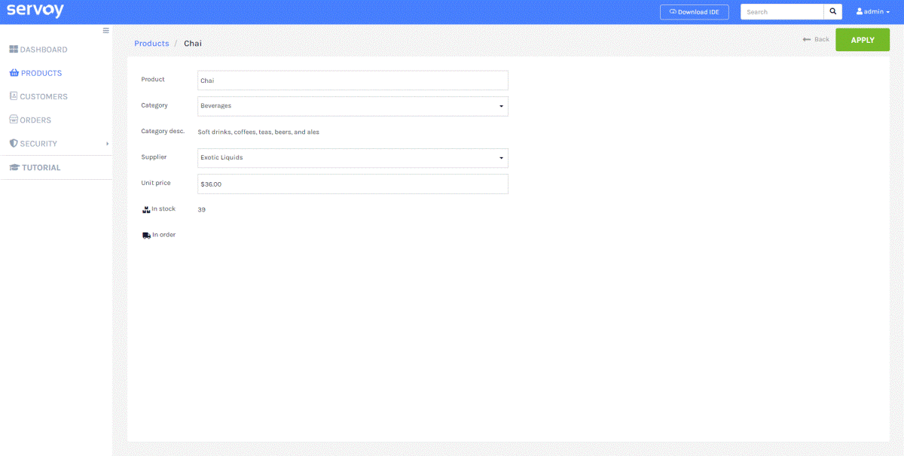
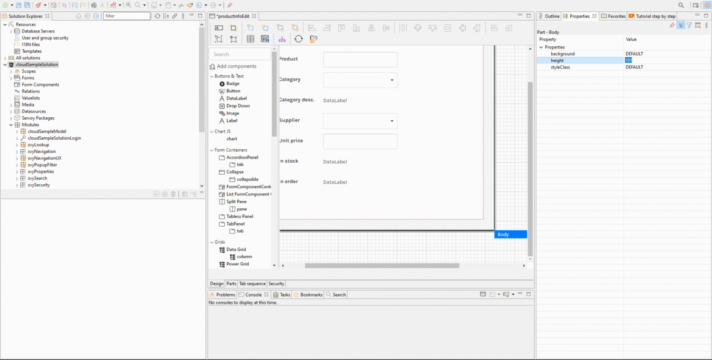
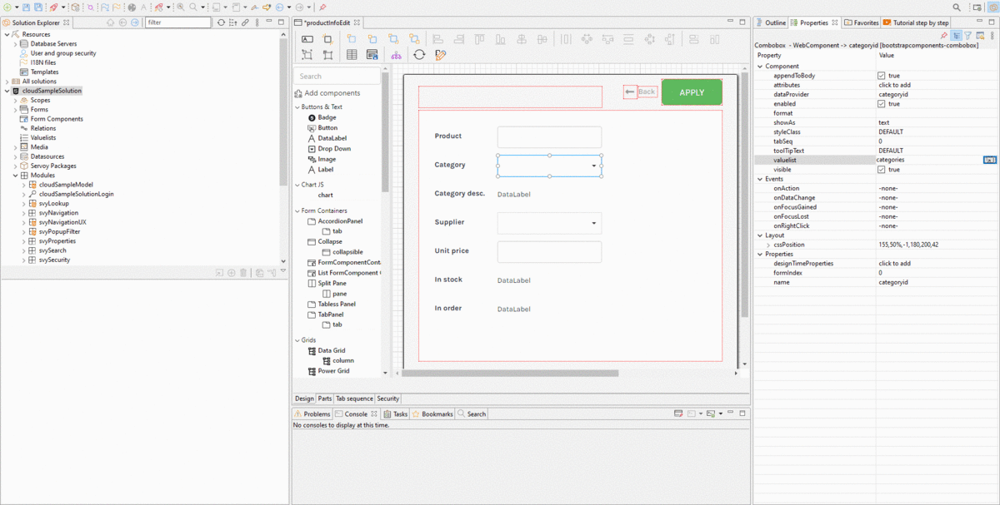
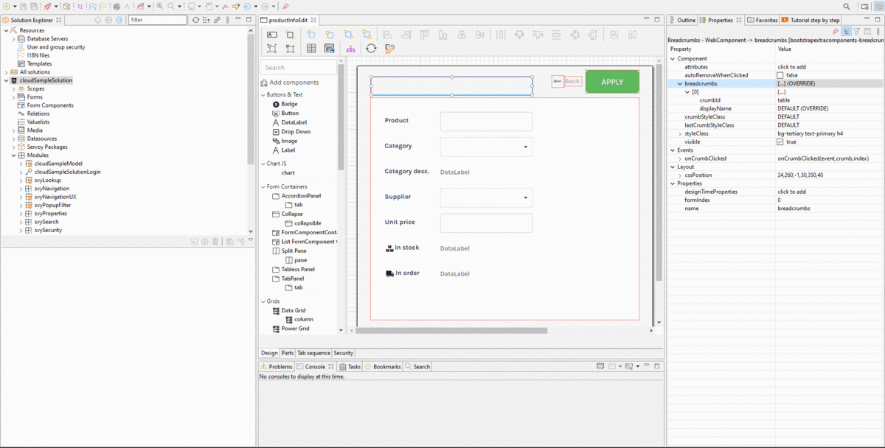

# Tutorial Part 2

In this step of the tutorial you will build an edit Form for product; learn how to build a Form to visualize, enter and edit data. You will then implement navigation between the product’s catalog implemented in the previous tutorials and the new edit Form.



### Introduction

The Servoy sample solution, cloudSampleSolution is the starting point for this tutorial. You will be walked through how the solution has been built creating new user interfaces, new features, learning the basic Servoy techniques. Make sure your environment is properly setup to start this journey. You need the Servoy sample database and the Servoy Sample solution to be your active solution.


### Create Form

You will now create the product’s edit Form. To create a new Form, in the **Solution Explorer** pane (left side), right-click the active Solution named _cloudSampleSolution_ and select **Create new form**. Type "productInfoEdit" as the form name.

* Select as Datasource of your Form the products table from the example\_data \_ database.
* Let the newly created Form Extends the existing Form baseCRUD.
* Click on Next, the wizard will allow you to place fields within the Form, already bound to the product Datasource.

**NOTE**: Despite the fact that you can choose any name, it is recommended to use the same naming of this tutorial since the object's name will be referenced in future steps.

### Place Fields

There are different types of components which can be used per field. In this form we will use the Textbox, a plain input field, the Combobox, an input field with drop-down list, the DataLabel, a read-only field where data is displayed as plain text. Double click the dataproviders in the following order and pick the specified Component type; note you can also pick dataproviders from related Datasources.

* productname (TextBox)
* categoryid: (Combobox)
* products\_to\_categories.description (DataLabel)
* supplierid: (Combobox)
* unitprice (TextBox)
* unitsinstock (DataLabel)
* unitsinorder (DataLabel)

Expand the **Advanced configuration**; decide to place a **label** aside of each field and define default size and spacing.

* Set value of Field Spacing to 13.
* Set Default size (w, h) with values 200, 42.
* Check Place fields with labels.
* Set value of Label Spacing to 0.
* Set Default size (w, h) with values 120, 42.
* Check Fill name property.

Finally click on Finish, you will be prompted to the productInfoEdit with the Servoy Form Editor.

### Adjust positioning

The chosen fields are now placed in the Form next to a descriptive label. Let’s adjust the position of these fields to get a nicer layout.

* Increase the minimum height of the form; select the form’s **body** and increase it’s height till 580 (value in pixels).
* Select the placed fields with their labels and move them from the top. Use the down arrow keys to move them.
* Make the size of the fields adjust to the Browser's size; select all fields in forms and change the **cssPosition right** value to 50%.



### Combobox Fields

In previous step we have selected the Combobox component type for the categoryid and the supplierid fields. We should now tell the component how to populate the drop-down list; it can be done by setting the **valuelist** property for the Combobox.

The valuelist object is a collection of items having a display value and real value; it is used to populate drop-down lists and resolve the selected real value with the respective display value.

* For the categoryid Combobox set the valuelist property; use the _categories_ valuelist.
* For the supplierid Combobox set the valuelist proeprty; use the _suppliers_ valuelist.



### Format Data

Format the the value of the unit price using the field Format Property.

* Select the unitprice field and set format value to ¤#.00.

Unitprice value will be formatted showing the currency sign and 2 decimals values.

### Icons

As part of a great user experience, icons communicate the core idea and intent of actions and they bring a lot of nice benefits enhancing aesthetic appeal. Using icons is simple; you can benefit from the large library of Font Awesome Icons or add your own set of icons.

* Select the unitsinstock\_label and set the imageStyleClass property to 'fas fa-boxes'.
* Select the unitsinorder\_label and set the imageStyleClass property to 'fas fa-truck'.

### Set the breadcrumb

The inherited base form comes with a "breadcrumbs" element used to display the navigation hierarchy. We will navigate to the form via the product’s grid; therefore in the breadcrumbs we will display two items; the first item in breadcrumbs is a reference to the product’s grid; the second item in breadcrumbs indicates the current form.

* Select the breadcrumbs element and add a new breadcrumbs item in the property.
* For the first breadcrumbs item set crumbId to 'table' and displayName to 'Products'.
* For the second breadcrumbs item set the crumbId to ‘edit’ and for displayName use the tag ‘%%productname%%’

Display tags %% can be used on text based properties to display the dataprovider value.



### Navigation from Grid

Now the form is ready to be displayed. Let’s implement navigation between the product’s grid and the product’s edit Form. From the product’s grid the user will navigate to the selected product upon double click.

* Open in Form Editor the "productsTableView" Form created during the first tutorial.
* Select the "table" element and set the onCellDoubleClick event.
* In the Select Method dialog click the “Create method in Form” button and confirm
* Finally click “Ok & Show” to be prompted into the Script Editor.

Navigating to the "productInfoEdit" Form can simply be implemented by calling the showForm API passing the Form productInfoEdit as argument

```javascript
function onCellDoubleClick(foundsetindex, columnindex, record, event) {
    showForm(forms.productInfoEdit);
}
```

### Navigate Back

Since the productInfoEdit Form extends the baseCRUD Form, it already inherits the functionality of the back button, which will navigate to the previously visited Form when clicked. You can allow the user to navigate back to the product’s grid also by clicking the breadcrumb item.

* Open the "productInfoEdit" in Form Editor and create an onCrumbClicked event for the breadcrumbs element.
* Select the breadcrumbs element and set the onCrumbClicked event.
* Using the Select Method dialog create method in Form and click “Ok & Show” to be prompted into the Script Editor.

Use same API, showForm to navigate back to the "productsTableView" Form.

```javascript
function onCrumbClicked(event, crumb, index) {
      showForm(forms.productsTableView);
}
```

### Create new record

In this final step you will allow the User to create new product entries. The productsTableView inherits from its base form the btnAdd element; the base form already offers a default implementation for creating a new entry in the Form’s Datasource; Extend the default implementation by navigating to the productInfoEdit Form for the newly created entry.

* In the "productsTableView" Form toggle the visibility of the "btnAdd" element to true.
* Use the Select Method dialog to override the base implementation of the onAction event.
* Create method in Form, confirm the method create with the name “newRecord”, will ask you to override the that form method; confirm and as usual click on “Ok & Show” to be prompted into the Script Editor.
* The \_super.newRecord runs the inherited implementation of the method, creating a new entry in Datasource. Amend the overridden method by calling the showForm just after the \_super.newRecord().

```javascript
function newRecord() {
     _super.newRecord();
      showForm(forms.productInfoEdit);
}
```

### Launch the Client

You can click **Launch NG Client** to see the result of your work. Click the newly created PRODUCTS menu option to see in action your new product catalog; double click products in grid to access the product's info.
