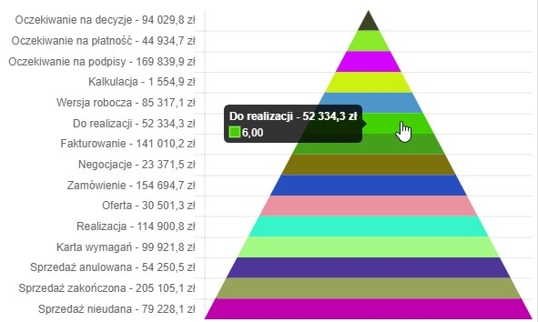
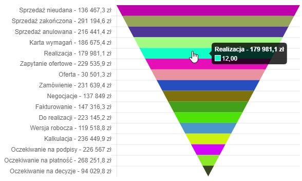
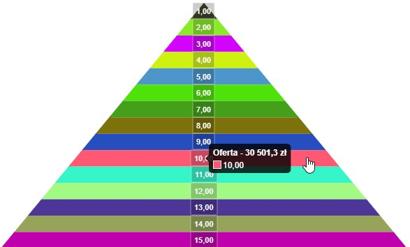
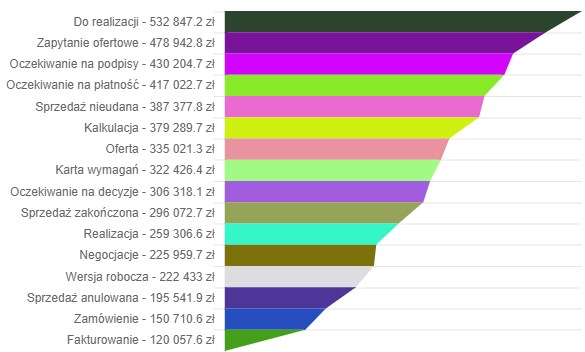
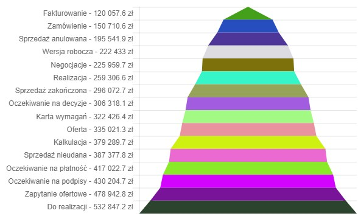

# Funnel Chart

## Preview

    

## Example Usage

```javascript
var data = {
	type: 'funnel',
	data: {
		labels: ["Red",
		"Green",
		"Yellow"],
	datasets: [{
		data: [300, 50, 100],
		backgroundColor: [
                      "#F7464A",
		      "#46BFBD",
		      "#FDB45C"],
		hoverBackgroundColor: [
                      "#FF5A5E",
		      "#5AD3D1",
		      "#FFC870"]
		}]
	}
}

//Initialize the chart by using setData
elements.chart.setData(data);
```

### Options

**sort**

Reverse or not, you can set 'desc' to draw an upside-down funnel. Default is 'asc'.

**gap**

The gap between to trapezium in our funnel chart. The unit is px. Default is 2

**keep**

Draw element against left or right side. Default is 'auto'.

**topWidth**

The top-width of funnel chart, defualt is 0.

**bottomWidth**

The bottom-width of funnel chart, default use the width of canvas.
