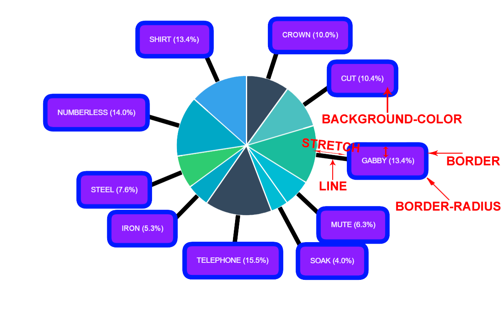
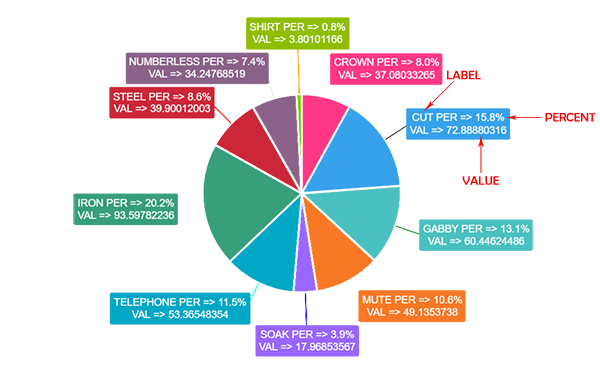

# OutLabels Plugin

```javascript
var data = {
	type: 'pie',
	data: {
		labels: ["Red",
		"Green",
		"Yellow"],
	datasets: [{
		data: [300, 50, 100],
		backgroundColor: [
                      "#F7464A",
		      "#46BFBD",
		      "#FDB45C"],
		hoverBackgroundColor: [
                      "#FF5A5E",
		      "#5AD3D1",
		      "#FFC870"]
		}]
	}
}

var options = {
	plugins: {
	  outlabels: {
		display: true,
		padding: 17,
		text: "%l (%p)",
		textAlign: "center"
		}
	}
}

//Initialize the chart by using setData
elements.chart.setData(data);
//Initialize additional options for outlabels plugin
elements.chart.setOptions(options);
```

## Options

```javascript
options.plugins.outlabels = {
    backgroundColor: "#8C1DFF", // Background color of Label
    borderColor: "#001BFF", // Border color of Label
    borderRadius: 17, // Border radius of Label
    borderWidth: 10, // Thickness of border
    color: 'white', // Font color
    display: true,
    lineWidth: 10, // Thickness of line between chart arc and Label
    padding: 17,
    stretch: 100, // The length between chart arc and Label
    text: "%l (%p)",
    textAlign: "center"
}
```



## Text Options

Label's content can be controlled by changing the text option's value. Labels can be displayed on multiple lines by using the newline character (\n) between each line.

The space between each line can be adjusted using the font.lineHeight option.

Following scopes will be replaced automatically:

```
%l: will be replaced by Label of the data
%p: will be replaced by Percent of the data
%v: will be replaced by Value of the data
\n: will be replaced by New Line
```

```javascript
//Example
options.plugins.outlabels: {
    text: '%l PER => %p \n VAL => %v'
}
```



\*Note that this plugin will not work when used along side data labels plugin (Use one or the other)
